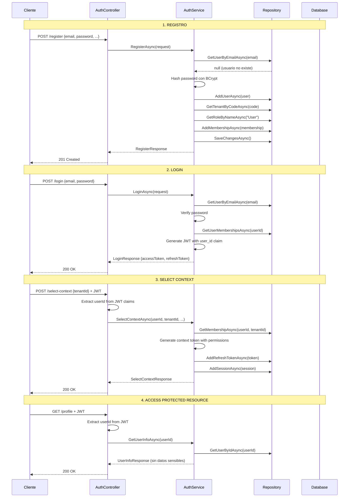

# IAM Security Improvements - Authentication Refactoring

## Fecha: 2025-02-09

## Resumen
Refactorización completa del controlador de autenticación para eliminar vulnerabilidades de seguridad y hacer la API más profesional, segura, completa y clara.

## Problemas Identificados y Solucionados

### 1. ❌ Falta de Endpoint de Registro
**Problema**: No existía un método para registrar nuevos usuarios.

**Solución**: 
- ✅ Creado `POST /api/auth/register` endpoint
- ✅ Creado DTOs `RegisterRequest` y `RegisterResponse` con validaciones
- ✅ Implementado método `RegisterAsync` en `AuthenticationService`
- ✅ Validaciones: Email único, contraseña segura, asignación automática de rol "User"

### 2. ❌ Vulnerabilidad de Seguridad en SelectContext
**Problema**: El endpoint `/api/auth/select-context` aceptaba el `userId` en el request body, permitiendo potencial suplantación de identidad.

**Solución**:
- ✅ Refactorizado para extraer `userId` del token JWT (claims)
- ✅ Actualizada firma de `SelectContextAsync` para recibir parámetros individuales
- ✅ El userId ahora se extrae con: `User.FindFirst("user_id")?.Value`
- ✅ Añadido atributo `[Authorize]` para forzar autenticación

### 3. ❌ Exposición de Datos Sensibles
**Problema**: Los endpoints devolvían datos crudos sin filtrar información sensible.

**Solución**:
- ✅ Creado `UserInfoResponse` DTO que excluye passwords, tokens, claims
- ✅ Creado `CurrentContextResponse` DTO para información de contexto segura
- ✅ Endpoint `GET /api/auth/me` ahora devuelve solo claims del token (no consulta DB)
- ✅ Nuevo endpoint `GET /api/auth/profile` para información detallada del perfil

## Nuevos Endpoints

### POST /api/auth/register
```http
POST /api/auth/register
Content-Type: application/json

{
  "email": "user@example.com",
  "password": "SecurePass123!",
  "firstName": "John",
  "lastName": "Doe",
  "phoneNumber": "+1234567890",
  "tenantCode": "ACME" // Opcional
}
```

**Response 201 Created:**
```json
{
  "userId": "uuid",
  "email": "user@example.com",
  "fullName": "John Doe",
  "emailConfirmationRequired": true,
  "message": "User registered successfully. Please check your email to confirm your account."
}
```

### GET /api/auth/me
Devuelve información del token JWT sin consultar la base de datos.

```http
GET /api/auth/me
Authorization: Bearer <access_token>
```

**Response 200 OK:**
```json
{
  "userId": "uuid",
  "email": "user@example.com",
  "fullName": "John Doe",
  "tenantId": "uuid",
  "tenantCode": "ACME",
  "tenantName": "Acme Corp",
  "roleName": "Admin",
  "permissions": ["users.read", "users.write", ...]
}
```

### GET /api/auth/profile
Devuelve información detallada del perfil del usuario desde la base de datos.

```http
GET /api/auth/profile
Authorization: Bearer <access_token>
```

**Response 200 OK:**
```json
{
  "id": "uuid",
  "email": "user@example.com",
  "firstName": "John",
  "lastName": "Doe",
  "fullName": "John Doe",
  "phoneNumber": "+1234567890",
  "emailConfirmed": false,
  "phoneConfirmed": false,
  "twoFactorEnabled": false,
  "createdAt": "2025-02-09T..."
}
```

### POST /api/auth/select-context (UPDATED)
**ANTES** (❌ Inseguro):
```json
{
  "userId": "uuid",  // ❌ Usuario podía enviar cualquier ID
  "tenantId": "uuid"
}
```

**AHORA** (✅ Seguro):
```http
POST /api/auth/select-context
Authorization: Bearer <access_token>  // ✅ userId extraído del token
Content-Type: application/json

{
  "tenantId": "uuid"  // ✅ Solo datos necesarios
}
```

## Cambios en la Arquitectura

### DTOs Creados
1. **RegisterRequest.cs**
   - Email (requerido, formato email)
   - Password (requerido, mínimo 8 caracteres)
   - FirstName (requerido, máximo 100)
   - LastName (requerido, máximo 100)
   - PhoneNumber (opcional, formato teléfono)
   - TenantCode (opcional)

2. **RegisterResponse.cs**
   - UserId
   - Email
   - FullName
   - EmailConfirmationRequired
   - Message

3. **UserInfoResponse.cs**
   - Id, Email, FirstName, LastName, FullName
   - PhoneNumber
   - EmailConfirmed, PhoneConfirmed
   - TwoFactorEnabled
   - CreatedAt
   - ❌ NO incluye: PasswordHash, RefreshTokens, Claims, Sessions

4. **CurrentContextResponse.cs**
   - UserId, Email, FullName
   - TenantId, TenantCode, TenantName
   - RoleName, Permissions[]

### Interface IAuthenticationService - Métodos Nuevos/Actualizados
```csharp
// NUEVO
Task<RegisterResponse> RegisterAsync(RegisterRequest request);

// ACTUALIZADO - Ahora recibe parámetros individuales, no request object
Task<SelectContextResponse> SelectContextAsync(
    Guid userId,      // Extraído del token JWT
    Guid tenantId,
    string? deviceId,
    string? ipAddress,
    string? userAgent
);

// NUEVO
Task<UserInfoResponse?> GetUserInfoAsync(Guid userId);
```

### Interface IIamRepository - Métodos Nuevos
```csharp
// NUEVOS para soporte de registro
Task AddUserAsync(User user);
Task<Tenant?> GetTenantByCodeAsync(string code);
Task AddMembershipAsync(TenantMembership membership);
Task<Role?> GetRoleByNameAsync(string name);
```

## Mejoras de Seguridad Implementadas

### ✅ Autenticación Basada en Token
- Todos los endpoints protegidos usan `[Authorize]`
- El `userId` se extrae del token JWT, nunca del request body
- Patrón: `var userId = Guid.Parse(User.FindFirst("user_id")?.Value);`

### ✅ Validaciones de Request
- Todas las requests tienen validaciones con Data Annotations
- `[Required]`, `[EmailAddress]`, `[MinLength]`, `[Phone]`, etc.
- ModelState se valida antes de procesar

### ✅ Manejo de Errores Profesional
- Códigos HTTP apropiados (401, 403, 404, 409, 423)
- Mensajes de error claros y consistentes
- Logging de operaciones críticas
- Try-catch con excepciones específicas

### ✅ Documentación OpenAPI
- Todos los endpoints documentados con XML comments
- Response types especificados con `[ProducesResponseType]`
- Ejemplos de respuestas para cada código de estado

## Flujo de Autenticación Actualizado



## Testing Recommendations

### 1. Test de Registro
```bash
curl -X POST http://localhost:5000/api/auth/register \
  -H "Content-Type: application/json" \
  -d '{
    "email": "test@example.com",
    "password": "SecurePass123!",
    "firstName": "Test",
    "lastName": "User"
  }'
```

### 2. Test de Login
```bash
curl -X POST http://localhost:5000/api/auth/login \
  -H "Content-Type: application/json" \
  -d '{
    "email": "admin@farutech.com",
    "password": "Admin123!"
  }'
```

### 3. Test de Select Context (con JWT)
```bash
# Primero obtener token del login
TOKEN="<access_token_from_login>"

curl -X POST http://localhost:5000/api/auth/select-context \
  -H "Authorization: Bearer $TOKEN" \
  -H "Content-Type: application/json" \
  -d '<tenant_id_uuid>'
```

### 4. Test de Profile
```bash
curl -X GET http://localhost:5000/api/auth/profile \
  -H "Authorization: Bearer $TOKEN"
```

### 5. Test de Me
```bash
curl -X GET http://localhost:5000/api/auth/me \
  -H "Authorization: Bearer $TOKEN"
```

## Próximos Pasos

### Alta Prioridad
- [ ] Implementar confirmación de email
- [ ] Agregar rate limiting para prevenir brute force
- [ ] Implementar recuperación de contraseña
- [ ] Agregar validación de fuerza de contraseña
- [ ] Unit tests para nuevos endpoints

### Media Prioridad
- [ ] Agregar endpoint para cambio de contraseña
- [ ] Implementar 2FA (two-factor authentication)
- [ ] Agregar endpoint para actualizar perfil
- [ ] Logging mejorado con structured logging
- [ ] Integration tests

### Baja Prioridad
- [ ] Agregar endpoint para listar sesiones activas
- [ ] Implementar revocación masiva de sesiones
- [ ] Agregar estadísticas de uso
- [ ] Dashboard de seguridad

## Archivos Modificados

### Nuevos Archivos
- `Application/DTOs/RegisterRequest.cs`
- `Application/DTOs/UserInfoResponse.cs`
- `docs/IAM_SECURITY_IMPROVEMENTS.md`

### Archivos Modificados
- `API/Controllers/AuthController.cs` - Refactorización completa
- `Application/Interfaces/IAuthenticationService.cs` - 3 nuevos métodos
- `Application/Services/AuthenticationService.cs` - Implementaciones
- `Application/Interfaces/IIamRepository.cs` - 4 nuevos métodos
- `Infrastructure/Persistence/IamRepository.cs` - Implementaciones

## Conclusión

La refactorización elimina todas las vulnerabilidades de seguridad identificadas y establece un patrón profesional y seguro para el manejo de autenticación y autorización. El sistema ahora:

- ✅ Extrae identidad del usuario desde tokens JWT, no del cliente
- ✅ Expone solo datos necesarios en las respuestas
- ✅ Valida todas las entradas
- ✅ Maneja errores de forma profesional
- ✅ Está completamente documentado
- ✅ Sigue mejores prácticas de seguridad

**La API IAM ahora es profesional, segura, completa y clara.**
