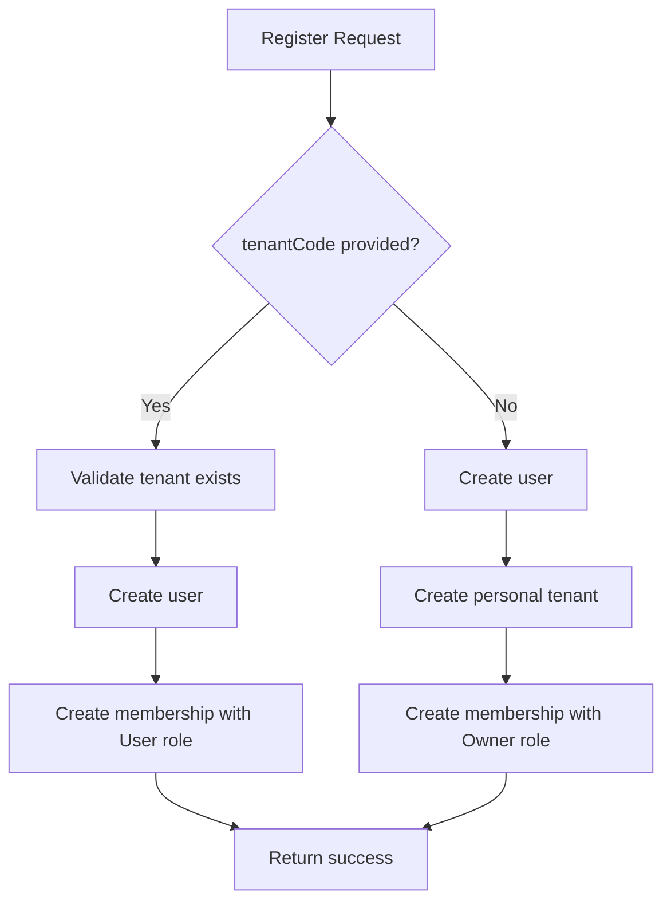

# Tenants Personales - Personal Workspace

## Descripción

El sistema IAM ahora soporta **tenants personales** automáticos para usuarios que se registran sin especificar un `tenantCode`. Esto permite que cualquier usuario pueda registrarse y obtener acceso inmediato al sistema con su propio espacio de trabajo.

## Comportamiento

### Registro CON `tenantCode` (Invitación a organización)
```json
{
  "email": "usuario@empresa.com",
  "password": "SecurePass123!",
  "firstName": "Juan",
  "lastName": "Pérez",
  "tenantCode": "empresa-abc"
}
```
- ✅ Se valida que el tenant `empresa-abc` exista
- ✅ Se crea el usuario
- ✅ Se asigna al tenant existente con rol **User**
- ✅ Login genera tokens inmediatamente (si tiene 1 solo tenant)

### Registro SIN `tenantCode` (Usuario nuevo)
```json
{
  "email": "webmaster@farutech.com",
  "password": "Holamundo1*",
  "firstName": "Web",
  "lastName": "Master"
}
```
- ✅ Se crea el usuario
- ✅ **Se crea automáticamente un tenant personal** con:
  - **Code**: `personal-{guid}` (ej: `personal-a1b2c3d4e5f6`)
  - **Name**: Nombre completo del usuario
  - **Features**: Configuración estándar
- ✅ Se asigna al usuario con rol **Owner** (acceso completo)
- ✅ Login genera tokens inmediatamente

## Credenciales de Prueba

### Usuario Admin (Tenant Corporativo)
```bash
Email: admin@farutech.com
Password: Admin123!
Tenant: farutech (Farutech Corporation)
Role: Owner
```

### Usuario Webmaster (Tenant Personal)
```bash
Email: webmaster@farutech.com
Password: Holamundo1*
Tenant: personal-XXXXXXXXXXXX (Web Master)
Role: Owner
```

## Login y Tokens

Después de implementar esta funcionalidad, **todos los usuarios pueden hacer login y obtener tokens**:

### Login Request
```bash
curl -X POST http://localhost:5001/api/auth/login \
  -H "Content-Type: application/json" \
  -d '{
    "email": "webmaster@farutech.com",
    "password": "Holamundo1*",
    "device": {
      "name": "API Test",
      "type": "Browser",
      "ipAddress": "127.0.0.1"
    }
  }'
```

### Login Response (Exitoso)
```json
{
  "publicUserId": "...",
  "email": "webmaster@farutech.com",
  "fullName": "Web Master",
  "requiresContextSelection": false,
  "availableContexts": [
    {
      "publicTenantId": "...",
      "tenantCode": "personal-a1b2c3d4e5f6",
      "tenantName": "Web Master",
      "publicMembershipId": "...",
      "roleName": "Owner",
      "isActive": true
    }
  ],
  "accessToken": "eyJhbGciOiJIUzI1NiIsInR5cCI6IkpXVCJ9...",
  "refreshToken": "...",
  "expiresAt": "2026-02-10T06:00:00Z"
}
```

## Casos de Uso

### 1. Usuario Individual (Freelancer, Desarrollador)
- Se registra sin `tenantCode`
- Obtiene su tenant personal automáticamente
- Trabaja solo en su espacio
- Puede invitar colaboradores más tarde

### 2. Usuario de Empresa (Empleado Invitado)
- Se registra con `tenantCode` de su empresa
- Se une al tenant corporativo
- Trabaja con permisos limitados (rol User)
- Puede tener múltiples membresías en diferentes tenants

### 3. Usuario Multi-Tenant (Consultor)
- Se registra primero sin `tenantCode` → tenant personal
- Luego es invitado a varios tenants corporativos
- Al hacer login, ve lista de tenants disponibles:
  - `personal-XXXX` (Owner)
  - `empresa-abc` (User)
  - `cliente-xyz` (Admin)
- Usa `/api/auth/select-context` para cambiar entre tenants

## Arquitectura Técnica

### Flujo de Registro



### Cambios de Código

**AuthenticationService.cs** (líneas 95-149):
- Detecta si `tenantCode` es null
- Crea tenant personal con formato `personal-{guid}`
- Asigna rol Owner para tenants personales
- Asigna rol User para tenants corporativos

**IamRepository.cs**:
- Agregado método `AddTenantAsync(Tenant tenant)`

**IIamRepository.cs**:
- Agregado interface `Task AddTenantAsync(Tenant tenant);`

## Migraciones Necesarias

✅ No se requieren migraciones nuevas. Los cambios son solo en lógica de negocio.

## Testing

### Test 1: Registro con tenant personal
```bash
curl -X POST http://localhost:5001/api/auth/register \
  -H "Content-Type: application/json" \
  -d '{
    "email": "test@example.com",
    "password": "Test123!",
    "firstName": "Test",
    "lastName": "User"
  }'
```
**Resultado esperado**: Usuario creado + Tenant personal creado

### Test 2: Login con tenant personal
```bash
curl -X POST http://localhost:5001/api/auth/login \
  -H "Content-Type: application/json" \
  -d '{
    "email": "test@example.com",
    "password": "Test123!"
  }'
```
**Resultado esperado**: accessToken ≠ null

### Test 3: Verificar tenant en base de datos
```sql
SELECT t."Code", t."Name", tm."RoleId", r."Name" as RoleName
FROM iam.tenants t
JOIN iam.tenant_memberships tm ON t."Id" = tm."TenantId"
JOIN iam.roles r ON tm."RoleId" = r."Id"
JOIN iam.users u ON tm."UserId" = u."Id"
WHERE u."Email" = 'test@example.com';
```
**Resultado esperado**: `personal-XXXXXXXXXXXX` con rol `Owner`

## Seguridad

### Consideraciones
- ✅ Cada tenant personal es completamente aislado
- ✅ El usuario tiene rol Owner solo en su tenant personal
- ✅ Puede ser invitado a otros tenants con roles limitados
- ✅ No puede acceder a datos de otros tenants personales
- ⚠️ Los códigos de tenant son aleatorios (no adivinables)

### Rate Limiting
Considerar implementar límites para prevenir abuso:
- Máximo X registros por IP/hora
- Máximo X tenants personales por usuario
- Validación de email obligatoria antes de acceso completo

## Roadmap Futuro

### Fase 1 (Implementado) ✅
- Creación automática de tenant personal
- Rol Owner para usuario creador
- Login con tokens inmediatos

### Fase 2 (Próximamente)
- [ ] Migración de tenant personal a corporativo
- [ ] Transferencia de propiedad de tenant
- [ ] Límites de recursos por tipo de tenant
- [ ] Planes de suscripción (Free, Pro, Enterprise)

### Fase 3 (Futuro)
- [ ] Invitaciones a colaboradores en tenant personal
- [ ] Conversión de tenant personal a equipo
- [ ] Facturación por tenant
- [ ] SSO para tenants corporativos

## FAQ

**Q: ¿Puedo tener múltiples tenants personales?**  
A: No. Un usuario solo puede tener un tenant personal (el primero que se crea). Luego puede ser invitado a tenants corporativos.

**Q: ¿Qué pasa si registro con `tenantCode` que no existe?**  
A: El registro falla con error `TENANT_NOT_FOUND`.

**Q: ¿Puedo cambiar el nombre de mi tenant personal?**  
A: Sí, se puede implementar un endpoint `/api/tenants/{id}` para actualizar metadatos.

**Q: ¿Los tenants personales tienen límites?**  
A: Por defecto no. Pero se pueden implementar límites basados en planes.

## Referencias

- [IAM Architecture](./IAM_ARCHITECTURE_ANALYSIS_AND_PROPOSAL_V2.md)
- [Tenant Management](./DIAGNOSTICO_ACCESO_MULTITENANT.md)
- [Security Best Practices](./IAM_SECURITY_IMPROVEMENTS.md)
