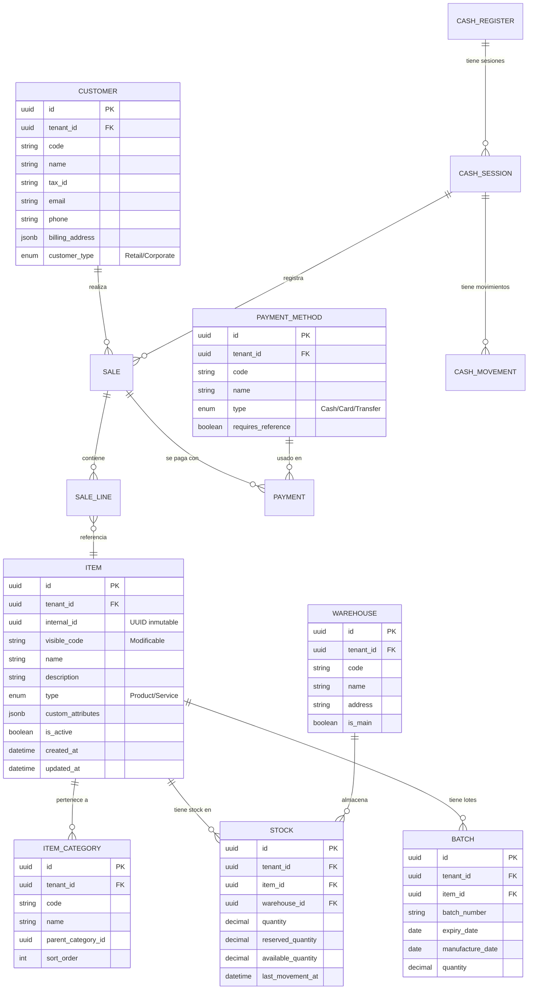

# REPORTE DE ESTADO INICIAL Y BRECHAS
## Ordeon: Farutech POS & Services - Integración con Orchestrator

**Fecha:** 25 de Enero, 2026  
**Versión:** 1.0  
**Analista:** Senior Full-Stack Developer (Arquitectura)  
**Audiencia:** Head of Product, Líderes Técnicos, Equipo de Desarrollo

---

## EXECUTIVE SUMMARY

Este documento presenta un análisis arquitectónico exhaustivo del **Farutech SaaS Orchestrator** existente y evalúa su preparación para soportar la **Ordeon: Farutech POS & Services**, un sistema de punto de venta y gestión de servicios empresariales multi-tenant. El análisis identifica fortalezas significativas en la arquitectura fundacional (Clean Architecture, DDD, Event Sourcing parcial) así como brechas críticas en tres áreas principales: **gestión de datos maestros**, **seguridad granular (RBAC)** y **control de efectivo/caja**.

**Hallazgos Clave:**
- ✅ **Orchestrator sólido:** La infraestructura actual (.NET 9, PostgreSQL, NATS, Workers Go) proporciona una base escalable y resiliente.
- ⚠️ **Brecha Crítica:** El catálogo de Features existente (Product → Module → Feature) no incluye módulos específicos para POS, maestros de inventario, o control de caja.
- 🚨 **Riesgo Alto:** Sin un modelo de seguridad granular (RBAC nivel ERP), el sistema no puede controlar acceso a operaciones sensibles como retiros de caja o anulaciones.
- 💡 **Oportunidad:** La arquitectura permite extensión sin modificar el Core. Ordeon puede consumir el SDK existente y extender el catálogo de Features mediante configuración.

---

## 1. ANÁLISIS DE INTEGRACIÓN SDK

### 1.1 Arquitectura del SDK Existente

El **Farutech.Orchestrator.SDK** (NuGet package, .NET Standard 2.1) proporciona una abstracción sobre la API del Orchestrator. Revisión del código actual:

```csharp
// Archivo: FarutechClient.cs (229 líneas)
public interface IFarutechClient
{
    Task<LoginResponse> LoginAsync(string email, string password);
    Task<SelectContextResponse> SelectContextAsync(Guid tenantId, string intermediateToken);
    Task<TenantConfigurationDto> GetMyConfigurationAsync(string accessToken, bool forceRefresh = false);
    Task<FeatureDto> GetFeatureAsync(string featureCode, string accessToken);
}
```

**Fortalezas Identificadas:**
- ✅ **Patrón Intermediate Token:** Soporte para multi-tenancy con selección de contexto post-login.
- ✅ **Caché inteligente:** `TenantConfigurationDto` se cachea por 10 minutos (configurable), reduciendo latencia.
- ✅ **Logging estructurado:** Integración con `ILogger<T>` de Microsoft.

### 1.2 Flujo de Autenticación para Ordeon

```mermaid
sequenceDiagram
    participant POS as Ordeon POS
    participant SDK as Farutech SDK
    participant API as Orchestrator API
    participant DB as PostgreSQL

    POS->>SDK: LoginAsync(email, password)
    SDK->>API: POST /api/Auth/login
    API->>DB: Validar credenciales
    DB-->>API: Usuario válido + TenantInstances[]
    API-->>SDK: IntermediateToken + AvailableTenants[]
    SDK-->>POS: LoginResponse (RequiresContextSelection=true)

    POS->>SDK: SelectContextAsync(tenantId, intermediateToken)
    SDK->>API: POST /api/Auth/select-context
    API->>DB: Validar acceso a tenant
    DB-->>API: Subscription activa + Features
    API-->>SDK: AccessToken (JWT con claim tenant_id)
    SDK-->>POS: AccessToken final

    POS->>SDK: GetMyConfigurationAsync(accessToken)
    SDK->>API: GET /api/Configuration/my-configuration
    API->>DB: SELECT * FROM subscriptions WHERE tenant_id = ?
    DB-->>API: Features habilitadas
    API-->>SDK: TenantConfigurationDto
    SDK-->>POS: Configuración cacheada
```



### 1.3 Endpoints del Orchestrator Requeridos por Ordeon

| Endpoint | Método | Propósito | Estado Actual |
|----------|--------|-----------|---------------|
| `/api/Auth/login` | POST | Autenticación inicial | ✅ Implementado |
| `/api/Auth/select-context` | POST | Selección de tenant | ✅ Implementado |
| `/api/Configuration/my-configuration` | GET | Obtener features activas | ✅ Implementado |
| `/api/Features/evaluate` | POST | Evaluar feature específica | ⚠️ **Falta implementar** |
| `/api/Subscriptions/current` | GET | Detalles de suscripción | ✅ Implementado |
| `/api/Catalog/modules?productCode=pos` | GET | Listar módulos POS | ⚠️ **Falta catálogo POS** |

### 1.4 Inyección de Contexto de Tenant

**Estrategia Actual:**
El SDK utiliza el header `Authorization: Bearer {token}` donde el JWT contiene el claim `tenant_id`. El middleware `TenantMiddleware.cs` en el Core extrae este claim y lo inyecta en el contexto de la solicitud.

```csharp
// Program.cs (línea 87-92)
app.UseAuthentication();
app.UseAuthorization();
// TenantMiddleware extrae tenant_id del JWT y lo inyecta en HttpContext
```

**Recomendación para Ordeon:**
- Registrar el SDK en `Startup.cs`:
```csharp
services.AddFarutechOrchestrator(options =>
{
    options.BaseUrl = "https://orchestrator.farutech.com";
    options.CacheExpirationMinutes = 10;
});
```

- Usar middleware para propagar contexto:
```csharp
app.UseFarutechTenantContext(); // Inyecta ITenantContext en cada request
```

### 1.5 Validación de Licencias en Runtime

**Propuesta de Implementación:**

```csharp
// Ordeon: Controllers/SalesController.cs
[ApiController]
[Route("api/[controller]")]
public class SalesController : ControllerBase
{
    private readonly IFarutechClient _orchestrator;
    
    [HttpPost("create-invoice")]
    [RequireFeature("pos_invoicing")] // Custom attribute
    public async Task<IActionResult> CreateInvoice([FromBody] CreateInvoiceRequest request)
    {
        // La validación de feature ocurre en el attribute filter
        // que consulta al SDK: await _orchestrator.GetFeatureAsync("pos_invoicing", accessToken)
        
        // Lógica de negocio...
        return Ok();
    }
}

// Custom attribute filter
public class RequireFeatureAttribute : TypeFilterAttribute
{
    public RequireFeatureAttribute(string featureCode) 
        : base(typeof(FeatureAuthorizationFilter))
    {
        Arguments = new object[] { featureCode };
    }
}

internal class FeatureAuthorizationFilter : IAsyncActionFilter
{
    private readonly IFarutechClient _client;
    private readonly string _featureCode;
    
    public async Task OnActionExecutionAsync(
        ActionExecutingContext context, 
        ActionExecutionDelegate next)
    {
        var accessToken = context.HttpContext.Request.Headers["Authorization"].ToString();
        var feature = await _client.GetFeatureAsync(_featureCode, accessToken);
        
        if (!feature.IsEnabled)
        {
            context.Result = new ForbidResult();
            return;
        }
        
        await next();
    }
}
```

---

## 2. ESTRATEGIA DE BASE DE DATOS MULTI-TENANT

### 2.1 Opciones de Aislamiento

| Estrategia | Descripción | Pros | Contras | Recomendación |
|------------|-------------|------|---------|---------------|
| **Schema-per-tenant** | Cada tenant tiene su propio schema en `farutech_db_cust` | ✅ Aislamiento fuerte<br>✅ Migraciones independientes<br>✅ Compliance favorable | ⚠️ Complejidad en conexiones<br>⚠️ Límite de ~100 schemas prácticos | **Recomendado para Enterprise tier** |
| **Database-per-tenant** | Cada tenant tiene BD física separada | ✅ Aislamiento máximo<br>✅ Backup independiente | ❌ Alto overhead de gestión<br>❌ Costos de infraestructura | Solo para clientes críticos (banca, salud) |
| **Row-level (tenant_id)** | Columna `tenant_id` en todas las tablas | ✅ Simple de implementar<br>✅ Escalable a 1000s tenants | ⚠️ Riesgo de filtrado incorrecto<br>⚠️ Compliance complejo | **Recomendado para Standard tier** |

### 2.2 Implementación con EF Core 9: Schema-per-tenant

**Viabilidad Técnica:**  
EF Core 9 soporta cambio dinámico de schema mediante el patrón **Connection Resolver**. A continuación, arquitectura propuesta:

```csharp
// Infrastructure: TenantSchemaConnectionFactory.cs
public interface ITenantSchemaResolver
{
    string GetSchemaForTenant(Guid tenantId);
}

public class TenantSchemaConnectionFactory
{
    private readonly string _baseConnectionString;
    private readonly ITenantSchemaResolver _resolver;
    
    public DbContextOptions<AppDbContext> CreateOptions(Guid tenantId)
    {
        var schema = _resolver.GetSchemaForTenant(tenantId);
        
        var optionsBuilder = new DbContextOptionsBuilder<AppDbContext>();
        optionsBuilder.UseNpgsql(_baseConnectionString, npgsqlOptions =>
        {
            npgsqlOptions.MigrationsHistoryTable("__EFMigrationsHistory", schema);
        });
        
        return optionsBuilder.Options;
    }
}

// DbContext con schema dinámico
public class AppDbContext : DbContext
{
    private readonly string _schema;
    
    public AppDbContext(DbContextOptions<AppDbContext> options, string schema) 
        : base(options)
    {
        _schema = schema;
    }
    
    protected override void OnModelCreating(ModelBuilder modelBuilder)
    {
        modelBuilder.HasDefaultSchema(_schema);
        
        // Configurar entidades
        modelBuilder.Entity<Item>().ToTable("items", _schema);
        modelBuilder.Entity<Category>().ToTable("categories", _schema);
        // ...
    }
}
```

**Uso en Controllers:**

```csharp
[ApiController]
public class ItemsController : ControllerBase
{
    private readonly ITenantContext _tenantContext;
    private readonly TenantSchemaConnectionFactory _factory;
    
    [HttpGet]
    public async Task<IActionResult> GetItems()
    {
        var tenantId = _tenantContext.CurrentTenantId;
        var options = _factory.CreateOptions(tenantId);
        
        using var context = new AppDbContext(options, $"tenant_{tenantId:N}");
        var items = await context.Items.ToListAsync();
        
        return Ok(items);
    }
}
```

### 2.3 Estrategia Alternativa: HasQueryFilter (Row-level)

Para el **Standard tier**, se recomienda `HasQueryFilter` con columna `tenant_id`:

```csharp
// OrchestratorDbContext.cs (línea 54-57 existente)
protected override void OnModelCreating(ModelBuilder modelBuilder)
{
    // Aplicar filtro global
    var tenantId = _tenantContext.CurrentTenantId;
    
    modelBuilder.Entity<Item>()
        .HasQueryFilter(i => i.TenantId == tenantId);
    
    modelBuilder.Entity<Sale>()
        .HasQueryFilter(s => s.TenantId == tenantId);
}

// Configuración en cada entidad
public class Item
{
    public Guid Id { get; set; }
    public Guid TenantId { get; set; } // ⚠️ Columna crítica
    public string Code { get; set; }
    public string Name { get; set; }
}
```

**⚠️ Consideración de Seguridad:**  
- Los filtros globales pueden ser ignorados con `.IgnoreQueryFilters()`.
- Implementar **auditoría** para detectar uso de este método.
- Restricción de política: Solo SuperAdmin puede usar `IgnoreQueryFilters()`.

### 2.4 Migraciones y Rollback por Schema

**Desafío:** Aplicar migrations a 50+ schemas sin downtime.

**Solución Propuesta:**

```csharp
// Script: migrate-all-tenants.ps1
$tenants = Get-TenantsFromOrchestrator
foreach ($tenant in $tenants) {
    $schema = "tenant_$($tenant.Id)"
    
    Write-Host "Migrando schema: $schema"
    
    # Aplicar migration con schema específico
    $env:TENANT_SCHEMA = $schema
    dotnet ef database update --context AppDbContext
    
    # Validar resultado
    $result = Test-SchemaIntegrity -Schema $schema
    if (-not $result.Success) {
        Write-Error "Rollback en $schema"
        Rollback-Schema -Schema $schema -ToMigration $result.LastValid
    }
}
```

**Estrategia de Rollback:**
1. Mantener snapshots de schemas antes de migration (`pg_dump --schema-only`).
2. Si falla, restaurar desde snapshot y aplicar migration anterior.
3. Notificar a Orchestrator sobre estado de tenant (`MIGRATION_FAILED`).

---

## 3. MAPEO DE LÓGICA DE NEGOCIO LEGACY

### 3.1 Análisis de Requerimientos del Sistema Legacy

Según el documento "Definición Producto Farutech.md", el sistema legacy incluye:

**Módulos Core Identificados:**
1. **Mostrador (Ventas y Servicios)**
   - Diferenciación entre venta de productos vs servicios
   - Cotizaciones con conversión a factura
   - Manejo de devoluciones y notas crédito

2. **Caja (Control de Efectivo)**
   - Apertura/cierre de caja con arqueo ciego
   - Sangrías y retiros justificados con documento soporte
   - Cuadre de caja al final del turno

3. **Inventario**
   - Control de lotes y fechas de vencimiento
   - Multi-bodega con transferencias
   - Ajustes de inventario (entrada, salida, merma)

4. **Facturación**
   - Facturación local (impresión térmica)
   - Facturación electrónica (integración DIAN Colombia, SAT México, SRI Ecuador)

### 3.2 Propuesta de Arquitectura Limpia (.NET 9)

```
Ordeon.POS/
├── Domain/                          # Lógica de negocio pura
│   ├── Aggregates/
│   │   ├── Sale/
│   │   │   ├── Sale.cs              # Root Aggregate
│   │   │   ├── SaleLine.cs          # Entity
│   │   │   ├── PaymentMethod.cs     # Value Object
│   │   │   └── Events/
│   │   │       ├── SaleCreatedEvent.cs
│   │   │       └── SaleCompletedEvent.cs
│   │   │
│   │   ├── CashRegister/
│   │   │   ├── CashRegister.cs      # Root Aggregate
│   │   │   ├── CashSession.cs       # Entity
│   │   │   ├── CashMovement.cs      # Entity (sangrías)
│   │   │   └── Events/
│   │   │       ├── SessionOpenedEvent.cs
│   │   │       └── WithdrawalRegisteredEvent.cs
│   │   │
│   │   └── Inventory/
│   │       ├── Item.cs               # Root Aggregate
│   │       ├── Batch.cs              # Entity (lotes)
│   │       ├── Stock.cs              # Entity (por bodega)
│   │       └── StockMovement.cs      # Entity (kardex)
│   │
│   ├── ValueObjects/
│   │   ├── Money.cs
│   │   ├── ItemCode.cs               # UUID interno + código visible
│   │   ├── TaxRate.cs
│   │   └── Discount.cs
│   │
│   └── Repositories/
│       ├── ISaleRepository.cs
│       ├── ICashRegisterRepository.cs
│       └── IItemRepository.cs
│
├── Application/                     # Casos de uso (CQRS)
│   ├── Commands/
│   │   ├── CreateSaleCommand.cs
│   │   ├── OpenCashSessionCommand.cs
│   │   └── RegisterWithdrawalCommand.cs
│   │
│   ├── Queries/
│   │   ├── GetActiveSalesQuery.cs
│   │   └── GetCashSessionBalanceQuery.cs
│   │
│   └── Handlers/
│       ├── CreateSaleCommandHandler.cs
│       └── GetActiveSalesQueryHandler.cs
│
├── Infrastructure/                  # Implementación técnica
│   ├── Persistence/
│   │   ├── AppDbContext.cs
│   │   ├── Repositories/
│   │   └── Migrations/
│   │
│   ├── ExternalServices/
│   │   ├── DianElectronicInvoiceService.cs  # Colombia
│   │   ├── SatElectronicInvoiceService.cs   # México
│   │   └── PrinterService.cs                # Impresión térmica
│   │
│   └── Orchestrator/
│       └── OrchesterFeatureService.cs        # Wrapper del SDK
│
└── API/                             # Capa de presentación
    ├── Controllers/
    │   ├── SalesController.cs
    │   ├── CashRegisterController.cs
    │   └── ItemsController.cs
    │
    └── Middleware/
        └── TenantContextMiddleware.cs
```

### 3.3 Flujos Core: Mostrador (Venta)

```csharp
// Domain/Aggregates/Sale/Sale.cs
public class Sale : AggregateRoot
{
    public Guid Id { get; private set; }
    public Guid TenantId { get; private set; }
    public string InvoiceNumber { get; private set; }
    public DateTime CreatedAt { get; private set; }
    public SaleType Type { get; private set; } // Product | Service
    public SaleStatus Status { get; private set; }
    public Guid CustomerId { get; private set; }
    public Guid CashierId { get; private set; }
    public Guid CashRegisterId { get; private set; }
    
    private List<SaleLine> _lines = new();
    private List<Payment> _payments = new();
    
    public IReadOnlyList<SaleLine> Lines => _lines.AsReadOnly();
    public Money Total => CalculateTotal();
    
    public static Result<Sale> Create(
        Guid tenantId, 
        Guid customerId, 
        Guid cashierId,
        Guid cashRegisterId,
        SaleType type)
    {
        // Validaciones...
        
        var sale = new Sale
        {
            Id = Guid.NewGuid(),
            TenantId = tenantId,
            CreatedAt = DateTime.UtcNow,
            Type = type,
            Status = SaleStatus.Draft,
            CustomerId = customerId,
            CashierId = cashierId,
            CashRegisterId = cashRegisterId
        };
        
        sale.RaiseDomainEvent(new SaleCreatedEvent
        {
            SaleId = sale.Id,
            TenantId = tenantId,
            Type = type
        });
        
        return Result<Sale>.Success(sale);
    }
    
    public Result AddLine(Guid itemId, string itemName, decimal quantity, Money unitPrice)
    {
        if (Status != SaleStatus.Draft)
            return Result.Failure("Solo se pueden agregar líneas a ventas en borrador");
        
        var line = new SaleLine
        {
            Id = Guid.NewGuid(),
            ItemId = itemId,
            ItemName = itemName,
            Quantity = quantity,
            UnitPrice = unitPrice,
            Subtotal = new Money(quantity * unitPrice.Amount, unitPrice.Currency)
        };
        
        _lines.Add(line);
        return Result.Success();
    }
    
    public Result Complete()
    {
        if (!_lines.Any())
            return Result.Failure("La venta debe tener al menos una línea");
        
        if (_payments.Sum(p => p.Amount.Amount) < Total.Amount)
            return Result.Failure("El total pagado es insuficiente");
        
        Status = SaleStatus.Completed;
        InvoiceNumber = GenerateInvoiceNumber(); // Lógica de numeración
        
        RaiseDomainEvent(new SaleCompletedEvent
        {
            SaleId = Id,
            TenantId = TenantId,
            Total = Total,
            CompletedAt = DateTime.UtcNow
        });
        
        return Result.Success();
    }
    
    private Money CalculateTotal()
    {
        var subtotal = _lines.Sum(l => l.Subtotal.Amount);
        var taxes = _lines.Sum(l => l.TaxAmount.Amount);
        var discounts = _lines.Sum(l => l.DiscountAmount.Amount);
        
        return new Money(subtotal + taxes - discounts, "COP");
    }
}

public enum SaleType { Product, Service }
public enum SaleStatus { Draft, Completed, Cancelled, Refunded }
```

### 3.4 Patrón CQRS para Lecturas Optimizadas

```csharp
// Application/Queries/GetActiveSalesQuery.cs
public record GetActiveSalesQuery(Guid TenantId, DateTime Date);

public class GetActiveSalesQueryHandler : IRequestHandler<GetActiveSalesQuery, List<SaleDto>>
{
    private readonly IDbConnection _connection; // Dapper para queries
    
    public async Task<List<SaleDto>> Handle(
        GetActiveSalesQuery request, 
        CancellationToken cancellationToken)
    {
        // Query optimizada (sin cargar aggregates completos)
        var sql = @"
            SELECT 
                s.id, 
                s.invoice_number, 
                s.created_at,
                s.total,
                c.name AS customer_name
            FROM sales s
            INNER JOIN customers c ON s.customer_id = c.id
            WHERE s.tenant_id = @TenantId
              AND s.status = 'Completed'
              AND DATE(s.created_at) = @Date
            ORDER BY s.created_at DESC";
        
        return await _connection.QueryAsync<SaleDto>(sql, new 
        { 
            TenantId = request.TenantId, 
            Date = request.Date 
        });
    }
}
```

### 3.5 Event Sourcing Parcial

**Decisión Arquitectónica:**  
No implementar Event Sourcing completo (overhead excesivo para POS), pero sí **proyecciones de eventos** para auditoría.

```csharp
// Infrastructure/EventStore/SaleEventProjection.cs
public class SaleEventProjection : INotificationHandler<SaleCompletedEvent>
{
    private readonly AppDbContext _context;
    
    public async Task Handle(SaleCompletedEvent notification, CancellationToken cancellationToken)
    {
        // Proyectar a tabla de auditoría
        var auditEntry = new SaleAudit
        {
            Id = Guid.NewGuid(),
            SaleId = notification.SaleId,
            TenantId = notification.TenantId,
            EventType = nameof(SaleCompletedEvent),
            EventData = JsonSerializer.Serialize(notification),
            OccurredAt = notification.CompletedAt
        };
        
        _context.SaleAudits.Add(auditEntry);
        await _context.SaveChangesAsync(cancellationToken);
    }
}
```

---

## 4. IDENTIFICACIÓN DE BRECHAS Y RIESGOS

### 4.1 Brechas en el Orchestrator Actual

| Brecha | Descripción | Impacto | Prioridad |
|--------|-------------|---------|-----------|
| **Catálogo POS Incompleto** | No existen Features para módulos POS (Items, Cajas, Servicios) | 🔴 **BLOQUEANTE** | P0 |
| **Endpoint `/api/Features/evaluate` faltante** | SDK actual no puede validar features específicas en runtime | 🟠 **ALTO** | P1 |
| **Modelo de datos maestros** | No hay tablas para Items, Categorías, Bodegas en Orchestrator | 🔴 **BLOQUEANTE** | P0 |
| **RBAC granular** | Solo hay roles básicos (Admin/User), sin permisos por módulo/acción | 🔴 **CRÍTICO** | P0 |
| **Control de efectivo** | No existe modelo para Cajas, Sesiones, Sangrías | 🔴 **BLOQUEANTE** | P0 |
| **Integración facturación electrónica** | Sin Feature para DIAN/SAT/SRI | 🟠 **ALTO** | P1 |

### 4.2 Nuevas Features/Modules Necesarias

**Propuesta de Extensión del Catálogo:**

```csharp
// Seed Data para Orchestrator
var posProduct = new Product
{
    Code = "farutech_pos",
    Name = "Farutech POS & Services",
    Description = "Sistema de punto de venta y gestión de servicios"
};

// MÓDULO 1: Maestros
var masterDataModule = new Module
{
    Code = "master_data",
    Name = "Datos Maestros",
    Features = new List<Feature>
    {
        new() { Code = "items_management", Name = "Gestión de Items", IsPremium = false },
        new() { Code = "categories_management", Name = "Categorías", IsPremium = false },
        new() { Code = "warehouses_management", Name = "Multi-bodega", IsPremium = true },
        new() { Code = "batch_control", Name = "Control de Lotes", IsPremium = true },
        new() { Code = "barcode_scanning", Name = "Escaneo de Códigos", IsPremium = false }
    }
};

// MÓDULO 2: Ventas y Servicios
var salesModule = new Module
{
    Code = "sales_services",
    Name = "Ventas y Servicios",
    Features = new List<Feature>
    {
        new() { Code = "pos_sales", Name = "Ventas POS", IsPremium = false },
        new() { Code = "service_orders", Name = "Órdenes de Servicio", IsPremium = false },
        new() { Code = "quotes_management", Name = "Cotizaciones", IsPremium = false },
        new() { Code = "refunds_credit_notes", Name = "Devoluciones y NC", IsPremium = true },
        new() { Code = "layaway_sales", Name = "Ventas Apartadas", IsPremium = true }
    }
};

// MÓDULO 3: Control de Caja (CRÍTICO)
var cashControlModule = new Module
{
    Code = "cash_control",
    Name = "Control de Efectivo",
    Features = new List<Feature>
    {
        new() { Code = "cash_session_management", Name = "Gestión de Sesiones", IsPremium = false },
        new() { Code = "blind_cash_count", Name = "Arqueo Ciego", IsPremium = true },
        new() { Code = "cash_withdrawals", Name = "Sangrías/Retiros", IsPremium = false },
        new() { Code = "session_audit_trail", Name = "Auditoría de Sesiones", IsPremium = true },
        new() { Code = "cash_reconciliation", Name = "Cuadre de Caja", IsPremium = false }
    }
};

// MÓDULO 4: Facturación
var invoicingModule = new Module
{
    Code = "invoicing",
    Name = "Facturación",
    Features = new List<Feature>
    {
        new() { Code = "local_invoicing", Name = "Facturación Local", IsPremium = false },
        new() { Code = "electronic_invoicing_co", Name = "Facturación DIAN (Colombia)", IsPremium = true },
        new() { Code = "electronic_invoicing_mx", Name = "Facturación SAT (México)", IsPremium = true },
        new() { Code = "electronic_invoicing_ec", Name = "Facturación SRI (Ecuador)", IsPremium = true },
        new() { Code = "thermal_printing", Name = "Impresión Térmica", IsPremium = false }
    }
};

// MÓDULO 5: Reportes
var reportsModule = new Module
{
    Code = "reports",
    Name = "Reportes y Analítica",
    Features = new List<Feature>
    {
        new() { Code = "daily_sales_report", Name = "Reporte Diario de Ventas", IsPremium = false },
        new() { Code = "inventory_valuation", Name = "Valorización de Inventario", IsPremium = true },
        new() { Code = "cashier_performance", Name = "Rendimiento de Cajeros", IsPremium = true },
        new() { Code = "top_selling_items", Name = "Productos Más Vendidos", IsPremium = false }
    }
};

posProduct.AddModule(masterDataModule);
posProduct.AddModule(salesModule);
posProduct.AddModule(cashControlModule);
posProduct.AddModule(invoicingModule);
posProduct.AddModule(reportsModule);
```

### 4.3 Riesgos Técnicos

| Riesgo | Probabilidad | Impacto | Mitigación |
|--------|--------------|---------|------------|
| **Latencia en validación de features** | Alta | Medio | Implementar caché local en Ordeon con TTL de 5 minutos |
| **Sincronización offline** | Media | Alto | Implementar IndexedDB en frontend + sincronización eventual |
| **Concurrencia en sesiones de caja** | Alta | Crítico | Usar optimistic locking (`RowVersion`) + transacciones SERIALIZABLE |
| **Desconexión del Orchestrator** | Baja | Crítico | Modo degradado: validar features contra snapshot local |
| **Ataque de inyección SQL en queries dinámicas** | Media | Crítico | Usar siempre queries parametrizadas (Dapper/EF Core) |
| **Fuga de datos entre tenants** | Baja | Catastrófico | Auditoría automática de queries sin filtro `tenant_id` |

### 4.4 Dependencias Externas

**Proveedor de Facturación Electrónica:**
- **Colombia (DIAN):** Integración con proveedor autorizado (ej: Dataico, Saphety)
- **México (SAT):** CFDI 4.0, requiere certificados digitales (CSD)
- **Ecuador (SRI):** Firmas electrónicas XADES-BES

**Pasarelas de Pago:**
- **Redsys** (España): Pagos con tarjeta débito/crédito
- **Mercado Pago** (Latam): QR + link de pago
- **PayU** (Colombia): Integración PSE para débitos bancarios

**Impresoras Fiscales:**
- Soporte para protocolos ESC/POS (Epson, Star Micronics)
- Driver Windows para impresoras fiscales argentinas (Hasar, Epson)

---

## 5. MODELO DE DATOS MAESTROS PARA POS

### 5.1 Entidades Necesarias



### 5.2 Estrategia de Identificadores: UUID vs Código Visible

**Problema:**  
Los usuarios necesitan códigos memorables (`PROD-001`, `CLI-12345`), pero cambiar estos códigos no debe romper la integridad referencial.

**Solución: Dual Identifier Pattern**

```csharp
public class Item
{
    // UUID inmutable (PK, usado para FK)
    public Guid Id { get; private set; } = Guid.NewGuid();
    
    // Código visible (modificable por usuario)
    public string VisibleCode { get; private set; }
    
    public string Name { get; private set; }
    
    // Cambiar código sin romper referencias
    public Result ChangeVisibleCode(string newCode)
    {
        if (string.IsNullOrWhiteSpace(newCode))
            return Result.Failure("El código no puede estar vacío");
        
        // Validar que no exista otro item con ese código
        // (implementado en repository)
        
        VisibleCode = newCode;
        return Result.Success();
    }
}

// En la BD
CREATE TABLE items (
    id UUID PRIMARY KEY DEFAULT gen_random_uuid(),
    tenant_id UUID NOT NULL,
    visible_code VARCHAR(50) NOT NULL,
    name VARCHAR(200) NOT NULL,
    CONSTRAINT uq_items_tenant_code UNIQUE (tenant_id, visible_code)
);

// Las FKs siempre usan UUID
CREATE TABLE sale_lines (
    id UUID PRIMARY KEY,
    sale_id UUID NOT NULL REFERENCES sales(id),
    item_id UUID NOT NULL REFERENCES items(id), -- FK por UUID, no por código
    quantity DECIMAL(18, 4) NOT NULL
);
```

**Ventajas:**
- ✅ El usuario puede cambiar `PROD-001` a `PROD-100` sin afectar ventas históricas.
- ✅ Las búsquedas por código son rápidas (índice único).
- ✅ No hay "efecto cascada" al cambiar códigos.

### 5.3 Tablas PostgreSQL (Schema: `tenant_<uuid>`)

```sql
-- Tabla: items
CREATE TABLE items (
    id UUID PRIMARY KEY DEFAULT gen_random_uuid(),
    tenant_id UUID NOT NULL,
    visible_code VARCHAR(50) NOT NULL,
    name VARCHAR(200) NOT NULL,
    description TEXT,
    type VARCHAR(20) NOT NULL CHECK (type IN ('Product', 'Service')),
    base_price DECIMAL(18, 2),
    tax_rate DECIMAL(5, 2) DEFAULT 0,
    custom_attributes JSONB,
    is_active BOOLEAN DEFAULT TRUE,
    created_at TIMESTAMP DEFAULT CURRENT_TIMESTAMP,
    updated_at TIMESTAMP,
    CONSTRAINT uq_items_tenant_code UNIQUE (tenant_id, visible_code)
);

CREATE INDEX idx_items_tenant ON items(tenant_id);
CREATE INDEX idx_items_type ON items(type);
CREATE INDEX idx_items_name ON items USING GIN (to_tsvector('spanish', name));

-- Tabla: warehouses
CREATE TABLE warehouses (
    id UUID PRIMARY KEY DEFAULT gen_random_uuid(),
    tenant_id UUID NOT NULL,
    code VARCHAR(20) NOT NULL,
    name VARCHAR(100) NOT NULL,
    address TEXT,
    is_main BOOLEAN DEFAULT FALSE,
    created_at TIMESTAMP DEFAULT CURRENT_TIMESTAMP,
    CONSTRAINT uq_warehouses_tenant_code UNIQUE (tenant_id, code)
);

-- Tabla: stock (inventario por bodega)
CREATE TABLE stock (
    id UUID PRIMARY KEY DEFAULT gen_random_uuid(),
    tenant_id UUID NOT NULL,
    item_id UUID NOT NULL REFERENCES items(id),
    warehouse_id UUID NOT NULL REFERENCES warehouses(id),
    quantity DECIMAL(18, 4) NOT NULL DEFAULT 0,
    reserved_quantity DECIMAL(18, 4) NOT NULL DEFAULT 0,
    available_quantity DECIMAL(18, 4) GENERATED ALWAYS AS (quantity - reserved_quantity) STORED,
    last_movement_at TIMESTAMP,
    CONSTRAINT uq_stock_item_warehouse UNIQUE (item_id, warehouse_id)
);

CREATE INDEX idx_stock_tenant ON stock(tenant_id);
CREATE INDEX idx_stock_item ON stock(item_id);

-- Tabla: batches (lotes con fechas de vencimiento)
CREATE TABLE batches (
    id UUID PRIMARY KEY DEFAULT gen_random_uuid(),
    tenant_id UUID NOT NULL,
    item_id UUID NOT NULL REFERENCES items(id),
    batch_number VARCHAR(50) NOT NULL,
    expiry_date DATE,
    manufacture_date DATE,
    quantity DECIMAL(18, 4) NOT NULL,
    warehouse_id UUID NOT NULL REFERENCES warehouses(id),
    created_at TIMESTAMP DEFAULT CURRENT_TIMESTAMP,
    CONSTRAINT uq_batches_item_number UNIQUE (item_id, batch_number)
);

-- Tabla: customers
CREATE TABLE customers (
    id UUID PRIMARY KEY DEFAULT gen_random_uuid(),
    tenant_id UUID NOT NULL,
    code VARCHAR(50) NOT NULL,
    name VARCHAR(200) NOT NULL,
    tax_id VARCHAR(50),
    email VARCHAR(100),
    phone VARCHAR(20),
    billing_address JSONB,
    customer_type VARCHAR(20) DEFAULT 'Retail' CHECK (customer_type IN ('Retail', 'Corporate')),
    created_at TIMESTAMP DEFAULT CURRENT_TIMESTAMP,
    CONSTRAINT uq_customers_tenant_code UNIQUE (tenant_id, code)
);

-- Tabla: payment_methods
CREATE TABLE payment_methods (
    id UUID PRIMARY KEY DEFAULT gen_random_uuid(),
    tenant_id UUID NOT NULL,
    code VARCHAR(20) NOT NULL,
    name VARCHAR(100) NOT NULL,
    type VARCHAR(20) NOT NULL CHECK (type IN ('Cash', 'Card', 'Transfer', 'Check')),
    requires_reference BOOLEAN DEFAULT FALSE,
    is_active BOOLEAN DEFAULT TRUE,
    CONSTRAINT uq_payment_methods_tenant_code UNIQUE (tenant_id, code)
);
```

### 5.4 Estrella de Datos para Analítica

**Tabla de Hechos (Fact Table):**

```sql
-- Tabla de hechos: sale_facts
CREATE TABLE sale_facts (
    id UUID PRIMARY KEY,
    tenant_id UUID NOT NULL,
    sale_date DATE NOT NULL,
    sale_datetime TIMESTAMP NOT NULL,
    
    -- Dimensiones (FK)
    customer_id UUID REFERENCES customers(id),
    item_id UUID REFERENCES items(id),
    warehouse_id UUID REFERENCES warehouses(id),
    cashier_id UUID REFERENCES users(id),
    payment_method_id UUID REFERENCES payment_methods(id),
    
    -- Métricas
    quantity DECIMAL(18, 4),
    unit_price DECIMAL(18, 2),
    subtotal DECIMAL(18, 2),
    tax_amount DECIMAL(18, 2),
    discount_amount DECIMAL(18, 2),
    total DECIMAL(18, 2),
    cost DECIMAL(18, 2),
    gross_profit DECIMAL(18, 2)
);

CREATE INDEX idx_sale_facts_date ON sale_facts(sale_date);
CREATE INDEX idx_sale_facts_tenant ON sale_facts(tenant_id);
CREATE INDEX idx_sale_facts_customer ON sale_facts(customer_id);
```

**Query de Reporte Típica:**

```sql
-- Top 10 productos más vendidos en Enero 2026
SELECT 
    i.name AS product_name,
    SUM(sf.quantity) AS total_quantity,
    SUM(sf.total) AS total_revenue,
    SUM(sf.gross_profit) AS total_profit
FROM sale_facts sf
INNER JOIN items i ON sf.item_id = i.id
WHERE sf.tenant_id = 'tenant-uuid-here'
  AND sf.sale_date BETWEEN '2026-01-01' AND '2026-01-31'
GROUP BY i.id, i.name
ORDER BY total_revenue DESC
LIMIT 10;
```

---

## 6. SEGURIDAD Y RBAC PARA POS

### 6.1 Arquitectura de Permisos Granular

**Modelo Propuesto: 4 Niveles de Control**

```mermaid
graph TD
    A[Usuario] --> B[Roles]
    B --> C[Permisos por Módulo]
    C --> D1[Permiso: Ventas - CRUD]
    C --> D2[Permiso: Caja - Apertura]
    C --> D3[Permiso: Inventario - Ajuste]
    C --> D4[Permiso: Reportes - Ver]
    
    D1 --> E1[Scope: Solo mis ventas]
    D1 --> E2[Scope: Todas las ventas]
    
    D2 --> F1[Acción: Abrir Sesión]
    D2 --> F2[Acción: Cerrar Sesión]
    D2 --> F3[Acción: Hacer Sangrías]
```



### 6.2 Tablas de Seguridad

```sql
-- Tabla: roles
CREATE TABLE roles (
    id UUID PRIMARY KEY DEFAULT gen_random_uuid(),
    tenant_id UUID NOT NULL,
    name VARCHAR(100) NOT NULL,
    description TEXT,
    is_system_role BOOLEAN DEFAULT FALSE, -- SuperAdmin, TenantAdmin
    created_at TIMESTAMP DEFAULT CURRENT_TIMESTAMP,
    CONSTRAINT uq_roles_tenant_name UNIQUE (tenant_id, name)
);

-- Tabla: permissions (catálogo global)
CREATE TABLE permissions (
    id UUID PRIMARY KEY DEFAULT gen_random_uuid(),
    code VARCHAR(100) NOT NULL UNIQUE, -- 'sales:create', 'cash:withdraw'
    module VARCHAR(50) NOT NULL, -- 'sales', 'cash', 'inventory'
    resource VARCHAR(50) NOT NULL, -- 'sale', 'cash_session', 'item'
    action VARCHAR(20) NOT NULL, -- 'create', 'read', 'update', 'delete', 'execute'
    description TEXT
);

INSERT INTO permissions (code, module, resource, action, description) VALUES
    ('sales:create', 'sales', 'sale', 'create', 'Crear nueva venta'),
    ('sales:read', 'sales', 'sale', 'read', 'Ver ventas'),
    ('sales:cancel', 'sales', 'sale', 'execute', 'Anular venta'),
    ('cash:open_session', 'cash', 'cash_session', 'create', 'Abrir sesión de caja'),
    ('cash:close_session', 'cash', 'cash_session', 'execute', 'Cerrar sesión de caja'),
    ('cash:withdraw', 'cash', 'cash_movement', 'create', 'Realizar sangría/retiro'),
    ('inventory:adjust', 'inventory', 'stock', 'update', 'Ajustar inventario'),
    ('reports:daily_sales', 'reports', 'report', 'read', 'Ver reporte diario');

-- Tabla: role_permissions (muchos a muchos)
CREATE TABLE role_permissions (
    id UUID PRIMARY KEY DEFAULT gen_random_uuid(),
    role_id UUID NOT NULL REFERENCES roles(id) ON DELETE CASCADE,
    permission_id UUID NOT NULL REFERENCES permissions(id),
    scope VARCHAR(50) DEFAULT 'all', -- 'own', 'department', 'all'
    CONSTRAINT uq_role_permission UNIQUE (role_id, permission_id)
);

-- Tabla: user_roles (muchos a muchos)
CREATE TABLE user_roles (
    id UUID PRIMARY KEY DEFAULT gen_random_uuid(),
    user_id UUID NOT NULL, -- Referencia a AspNetUsers del Orchestrator
    role_id UUID NOT NULL REFERENCES roles(id) ON DELETE CASCADE,
    tenant_id UUID NOT NULL,
    assigned_at TIMESTAMP DEFAULT CURRENT_TIMESTAMP,
    assigned_by UUID,
    CONSTRAINT uq_user_role_tenant UNIQUE (user_id, role_id, tenant_id)
);
```

### 6.3 Evaluación de Permisos en Runtime

```csharp
// Application/Authorization/PermissionService.cs
public interface IPermissionService
{
    Task<bool> HasPermissionAsync(Guid userId, string permissionCode, CancellationToken ct = default);
    Task<PermissionScope> GetPermissionScopeAsync(Guid userId, string permissionCode);
}

public class PermissionService : IPermissionService
{
    private readonly AppDbContext _context;
    private readonly IMemoryCache _cache;
    
    public async Task<bool> HasPermissionAsync(Guid userId, string permissionCode, CancellationToken ct)
    {
        // Cachear permisos del usuario por 5 minutos
        var cacheKey = $"permissions:{userId}";
        
        if (!_cache.TryGetValue(cacheKey, out HashSet<string> permissions))
        {
            // Query optimizada con Dapper
            permissions = await _context.Database.GetDbConnection()
                .QueryAsync<string>(@"
                    SELECT p.code
                    FROM user_roles ur
                    INNER JOIN role_permissions rp ON ur.role_id = rp.role_id
                    INNER JOIN permissions p ON rp.permission_id = p.id
                    WHERE ur.user_id = @UserId
                ", new { UserId = userId })
                .ToHashSet();
            
            _cache.Set(cacheKey, permissions, TimeSpan.FromMinutes(5));
        }
        
        return permissions.Contains(permissionCode);
    }
    
    public async Task<PermissionScope> GetPermissionScopeAsync(Guid userId, string permissionCode)
    {
        var scope = await _context.Database.GetDbConnection()
            .QueryFirstOrDefaultAsync<string>(@"
                SELECT rp.scope
                FROM user_roles ur
                INNER JOIN role_permissions rp ON ur.role_id = rp.role_id
                INNER JOIN permissions p ON rp.permission_id = p.id
                WHERE ur.user_id = @UserId AND p.code = @PermissionCode
                LIMIT 1
            ", new { UserId = userId, PermissionCode = permissionCode });
        
        return Enum.Parse<PermissionScope>(scope ?? "Own");
    }
}

public enum PermissionScope { Own, Department, All }
```

### 6.4 Attribute Filter para Authorization

```csharp
// API/Filters/RequirePermissionAttribute.cs
[AttributeUsage(AttributeTargets.Method | AttributeTargets.Class)]
public class RequirePermissionAttribute : TypeFilterAttribute
{
    public RequirePermissionAttribute(string permissionCode) 
        : base(typeof(PermissionAuthorizationFilter))
    {
        Arguments = new object[] { permissionCode };
    }
}

internal class PermissionAuthorizationFilter : IAsyncActionFilter
{
    private readonly IPermissionService _permissionService;
    private readonly string _permissionCode;
    
    public PermissionAuthorizationFilter(IPermissionService permissionService, string permissionCode)
    {
        _permissionService = permissionService;
        _permissionCode = permissionCode;
    }
    
    public async Task OnActionExecutionAsync(ActionExecutingContext context, ActionExecutionDelegate next)
    {
        var userId = context.HttpContext.User.FindFirst(ClaimTypes.NameIdentifier)?.Value;
        
        if (string.IsNullOrEmpty(userId) || !Guid.TryParse(userId, out var userGuid))
        {
            context.Result = new UnauthorizedResult();
            return;
        }
        
        var hasPermission = await _permissionService.HasPermissionAsync(userGuid, _permissionCode);
        
        if (!hasPermission)
        {
            context.Result = new ForbidResult();
            return;
        }
        
        await next();
    }
}

// Uso en Controllers
[ApiController]
[Route("api/[controller]")]
public class CashRegisterController : ControllerBase
{
    [HttpPost("open-session")]
    [RequirePermission("cash:open_session")]
    public async Task<IActionResult> OpenSession([FromBody] OpenSessionRequest request)
    {
        // Solo usuarios con permiso 'cash:open_session' pueden ejecutar
        return Ok();
    }
    
    [HttpPost("withdraw")]
    [RequirePermission("cash:withdraw")]
    public async Task<IActionResult> RegisterWithdrawal([FromBody] WithdrawalRequest request)
    {
        // Validación adicional: scope
        var scope = await _permissionService.GetPermissionScopeAsync(CurrentUserId, "cash:withdraw");
        
        if (scope == PermissionScope.Own)
        {
            // Solo puede hacer retiros de su propia sesión
            var session = await _cashService.GetActiveSessionAsync(request.CashRegisterId);
            if (session.CashierId != CurrentUserId)
                return Forbid("No tiene permiso para hacer retiros en esta caja");
        }
        
        // Procesar retiro...
        return Ok();
    }
}
```

### 6.5 Roles Predefinidos

```csharp
// Infrastructure/Seeders/RoleSeeder.cs
public static class RoleSeeder
{
    public static void SeedDefaultRoles(AppDbContext context, Guid tenantId)
    {
        var roles = new List<Role>
        {
            new() 
            { 
                Name = "SuperAdmin", 
                Description = "Acceso total al sistema",
                IsSystemRole = true,
                TenantId = tenantId
            },
            new() 
            { 
                Name = "Gerente", 
                Description = "Gestión completa de POS y reportes",
                TenantId = tenantId
            },
            new() 
            { 
                Name = "Cajero", 
                Description = "Operación de caja y ventas",
                TenantId = tenantId
            },
            new() 
            { 
                Name = "Vendedor", 
                Description = "Solo ventas, sin acceso a caja",
                TenantId = tenantId
            },
            new() 
            { 
                Name = "Auditor", 
                Description = "Solo lectura de reportes y auditoría",
                TenantId = tenantId
            }
        };
        
        context.Roles.AddRange(roles);
        context.SaveChanges();
        
        // Asignar permisos al rol Cajero
        var cajeroRole = roles.First(r => r.Name == "Cajero");
        var permissions = context.Permissions.Where(p => new[]
        {
            "sales:create", "sales:read",
            "cash:open_session", "cash:close_session", "cash:withdraw",
            "reports:daily_sales"
        }.Contains(p.Code)).ToList();
        
        foreach (var permission in permissions)
        {
            context.RolePermissions.Add(new RolePermission
            {
                RoleId = cajeroRole.Id,
                PermissionId = permission.Id,
                Scope = permission.Code.StartsWith("cash") ? "own" : "all"
            });
        }
        
        context.SaveChanges();
    }
}
```

---

## 7. CONTROL DE EFECTIVO (CRÍTICO PARA POS)

### 7.1 Modelo de Datos: Cajas y Sesiones

```sql
-- Tabla: cash_registers (cajas físicas)
CREATE TABLE cash_registers (
    id UUID PRIMARY KEY DEFAULT gen_random_uuid(),
    tenant_id UUID NOT NULL,
    code VARCHAR(20) NOT NULL,
    name VARCHAR(100) NOT NULL,
    warehouse_id UUID REFERENCES warehouses(id),
    is_active BOOLEAN DEFAULT TRUE,
    created_at TIMESTAMP DEFAULT CURRENT_TIMESTAMP,
    CONSTRAINT uq_cash_registers_tenant_code UNIQUE (tenant_id, code)
);

-- Tabla: cash_sessions (turnos de caja)
CREATE TABLE cash_sessions (
    id UUID PRIMARY KEY DEFAULT gen_random_uuid(),
    tenant_id UUID NOT NULL,
    cash_register_id UUID NOT NULL REFERENCES cash_registers(id),
    cashier_id UUID NOT NULL, -- FK a AspNetUsers
    
    -- Ciclo de vida
    status VARCHAR(20) NOT NULL DEFAULT 'Open' CHECK (status IN ('Open', 'Closed', 'Cancelled')),
    opened_at TIMESTAMP NOT NULL DEFAULT CURRENT_TIMESTAMP,
    closed_at TIMESTAMP,
    
    -- Montos
    initial_amount DECIMAL(18, 2) NOT NULL, -- Efectivo inicial (base)
    expected_amount DECIMAL(18, 2), -- Calculado: inicial + ventas - retiros
    actual_amount DECIMAL(18, 2), -- Contado físicamente (arqueo)
    difference DECIMAL(18, 2), -- actual - expected (sobrante/faltante)
    
    -- Auditoría
    opened_by UUID NOT NULL,
    closed_by UUID,
    notes TEXT,
    
    CONSTRAINT chk_closed_session CHECK (
        (status = 'Closed' AND closed_at IS NOT NULL AND actual_amount IS NOT NULL) OR
        (status = 'Open' AND closed_at IS NULL AND actual_amount IS NULL)
    )
);

CREATE INDEX idx_cash_sessions_cashier ON cash_sessions(cashier_id);
CREATE INDEX idx_cash_sessions_status ON cash_sessions(status);
CREATE INDEX idx_cash_sessions_dates ON cash_sessions(opened_at, closed_at);

-- Tabla: cash_movements (sangrías/retiros)
CREATE TABLE cash_movements (
    id UUID PRIMARY KEY DEFAULT gen_random_uuid(),
    tenant_id UUID NOT NULL,
    cash_session_id UUID NOT NULL REFERENCES cash_sessions(id),
    
    type VARCHAR(20) NOT NULL CHECK (type IN ('Withdrawal', 'Deposit', 'Correction')),
    amount DECIMAL(18, 2) NOT NULL,
    reason TEXT NOT NULL,
    
    -- Documento soporte (generado por motor transaccional)
    support_document_id UUID, -- FK a trx__documents (si existe)
    support_document_number VARCHAR(50),
    
    -- Auditoría
    created_at TIMESTAMP DEFAULT CURRENT_TIMESTAMP,
    created_by UUID NOT NULL,
    authorized_by UUID, -- Supervisor que autorizó
    
    -- Control de fraude
    requires_authorization BOOLEAN DEFAULT TRUE,
    authorization_status VARCHAR(20) DEFAULT 'Pending' CHECK (authorization_status IN ('Pending', 'Approved', 'Rejected'))
);

CREATE INDEX idx_cash_movements_session ON cash_movements(cash_session_id);
CREATE INDEX idx_cash_movements_type ON cash_movements(type);
```

### 7.2 Ciclo Operativo: Apertura y Cierre

```csharp
// Domain/Aggregates/CashRegister/CashSession.cs
public class CashSession : AggregateRoot
{
    public Guid Id { get; private set; }
    public Guid TenantId { get; private set; }
    public Guid CashRegisterId { get; private set; }
    public Guid CashierId { get; private set; }
    
    public CashSessionStatus Status { get; private set; }
    public DateTime OpenedAt { get; private set; }
    public DateTime? ClosedAt { get; private set; }
    
    public Money InitialAmount { get; private set; }
    public Money? ExpectedAmount { get; private set; }
    public Money? ActualAmount { get; private set; }
    public Money? Difference => ActualAmount - ExpectedAmount;
    
    private List<CashMovement> _movements = new();
    public IReadOnlyList<CashMovement> Movements => _movements.AsReadOnly();
    
    // APERTURA DE SESIÓN
    public static Result<CashSession> Open(
        Guid tenantId,
        Guid cashRegisterId,
        Guid cashierId,
        Money initialAmount)
    {
        if (initialAmount.Amount < 0)
            return Result<CashSession>.Failure("El monto inicial no puede ser negativo");
        
        var session = new CashSession
        {
            Id = Guid.NewGuid(),
            TenantId = tenantId,
            CashRegisterId = cashRegisterId,
            CashierId = cashierId,
            Status = CashSessionStatus.Open,
            OpenedAt = DateTime.UtcNow,
            InitialAmount = initialAmount
        };
        
        session.RaiseDomainEvent(new SessionOpenedEvent
        {
            SessionId = session.Id,
            CashRegisterId = cashRegisterId,
            CashierId = cashierId,
            InitialAmount = initialAmount,
            OpenedAt = session.OpenedAt
        });
        
        return Result<CashSession>.Success(session);
    }
    
    // REGISTRAR SANGRÍA (RETIRO)
    public Result<CashMovement> RegisterWithdrawal(
        Money amount,
        string reason,
        Guid authorizedBy)
    {
        if (Status != CashSessionStatus.Open)
            return Result<CashMovement>.Failure("Solo se pueden hacer retiros en sesiones abiertas");
        
        if (amount.Amount <= 0)
            return Result<CashMovement>.Failure("El monto debe ser positivo");
        
        if (string.IsNullOrWhiteSpace(reason))
            return Result<CashMovement>.Failure("Debe especificar una razón para el retiro");
        
        var movement = new CashMovement
        {
            Id = Guid.NewGuid(),
            Type = CashMovementType.Withdrawal,
            Amount = amount,
            Reason = reason,
            AuthorizedBy = authorizedBy,
            CreatedAt = DateTime.UtcNow
        };
        
        _movements.Add(movement);
        
        RaiseDomainEvent(new WithdrawalRegisteredEvent
        {
            SessionId = Id,
            MovementId = movement.Id,
            Amount = amount,
            Reason = reason,
            AuthorizedBy = authorizedBy
        });
        
        return Result<CashMovement>.Success(movement);
    }
    
    // CIERRE DE SESIÓN (ARQUEO)
    public Result Close(Money actualAmount, Guid closedBy)
    {
        if (Status != CashSessionStatus.Open)
            return Result.Failure("Solo se pueden cerrar sesiones abiertas");
        
        if (actualAmount.Amount < 0)
            return Result.Failure("El monto actual no puede ser negativo");
        
        // Calcular expected: inicial + ventas - retiros
        var salesTotal = CalculateSalesTotal(); // Query a tabla sales
        var withdrawalsTotal = _movements
            .Where(m => m.Type == CashMovementType.Withdrawal)
            .Sum(m => m.Amount.Amount);
        
        ExpectedAmount = new Money(
            InitialAmount.Amount + salesTotal - withdrawalsTotal,
            InitialAmount.Currency
        );
        
        ActualAmount = actualAmount;
        Status = CashSessionStatus.Closed;
        ClosedAt = DateTime.UtcNow;
        
        RaiseDomainEvent(new SessionClosedEvent
        {
            SessionId = Id,
            ExpectedAmount = ExpectedAmount.Value,
            ActualAmount = ActualAmount.Value,
            Difference = Difference!.Value,
            ClosedAt = ClosedAt.Value,
            ClosedBy = closedBy
        });
        
        // ⚠️ ALERTA DE FRAUDE: Si diferencia > 5% o > $50, notificar
        var diffPercentage = Math.Abs(Difference!.Value.Amount / ExpectedAmount.Value.Amount * 100);
        if (diffPercentage > 5 || Math.Abs(Difference.Value.Amount) > 50)
        {
            RaiseDomainEvent(new CashDiscrepancyDetectedEvent
            {
                SessionId = Id,
                Difference = Difference.Value,
                Percentage = diffPercentage,
                RequiresInvestigation = true
            });
        }
        
        return Result.Success();
    }
}

public enum CashSessionStatus { Open, Closed, Cancelled }
public enum CashMovementType { Withdrawal, Deposit, Correction }
```

### 7.3 Generación de Documento Soporte

**Integración con Motor Transaccional:**

```csharp
// Application/Commands/RegisterWithdrawalCommand.cs
public record RegisterWithdrawalCommand(
    Guid TenantId,
    Guid CashSessionId,
    decimal Amount,
    string Currency,
    string Reason,
    Guid AuthorizedBy
) : IRequest<Result<WithdrawalResponse>>;

public class RegisterWithdrawalCommandHandler : IRequestHandler<RegisterWithdrawalCommand, Result<WithdrawalResponse>>
{
    private readonly ICashSessionRepository _sessionRepo;
    private readonly ITransactionalDocumentService _docService; // Motor transaccional
    
    public async Task<Result<WithdrawalResponse>> Handle(
        RegisterWithdrawalCommand request, 
        CancellationToken cancellationToken)
    {
        // 1. Obtener sesión activa
        var session = await _sessionRepo.GetByIdAsync(request.CashSessionId);
        if (session == null)
            return Result<WithdrawalResponse>.Failure("Sesión no encontrada");
        
        // 2. Registrar retiro en el aggregate
        var amount = new Money(request.Amount, request.Currency);
        var movementResult = session.RegisterWithdrawal(amount, request.Reason, request.AuthorizedBy);
        
        if (!movementResult.IsSuccess)
            return Result<WithdrawalResponse>.Failure(movementResult.Error);
        
        var movement = movementResult.Value;
        
        // 3. Generar documento soporte usando motor transaccional
        var documentResult = await _docService.CreateDocumentAsync(new CreateDocumentRequest
        {
            TenantId = request.TenantId,
            DocumentTypeCode = "CASH_WITHDRAWAL",
            ReferenceNumber = $"RET-{DateTime.UtcNow:yyyyMMdd}-{movement.Id:N}",
            Metadata = new Dictionary<string, object>
            {
                ["cash_session_id"] = request.CashSessionId,
                ["cash_movement_id"] = movement.Id,
                ["amount"] = request.Amount,
                ["reason"] = request.Reason,
                ["authorized_by"] = request.AuthorizedBy
            },
            Lines = new List<DocumentLine>
            {
                new()
                {
                    Description = $"Retiro de caja: {request.Reason}",
                    Amount = request.Amount,
                    Quantity = 1
                }
            }
        });
        
        if (!documentResult.IsSuccess)
            return Result<WithdrawalResponse>.Failure("Error al generar documento soporte");
        
        // 4. Vincular documento al movimiento
        movement.AttachSupportDocument(documentResult.Value.DocumentId, documentResult.Value.DocumentNumber);
        
        // 5. Persistir
        await _sessionRepo.UpdateAsync(session);
        await _sessionRepo.UnitOfWork.CommitAsync(cancellationToken);
        
        return Result<WithdrawalResponse>.Success(new WithdrawalResponse
        {
            MovementId = movement.Id,
            SupportDocumentId = documentResult.Value.DocumentId,
            SupportDocumentNumber = documentResult.Value.DocumentNumber,
            Amount = request.Amount
        });
    }
}
```

### 7.4 Reporte de Cuadre de Caja

```csharp
// Application/Queries/GetCashSessionReportQuery.cs
public record GetCashSessionReportQuery(Guid SessionId) : IRequest<CashSessionReportDto>;

public class CashSessionReportDto
{
    public Guid SessionId { get; init; }
    public string CashRegisterName { get; init; }
    public string CashierName { get; init; }
    public DateTime OpenedAt { get; init; }
    public DateTime? ClosedAt { get; init; }
    
    public decimal InitialAmount { get; init; }
    public decimal SalesTotal { get; init; }
    public decimal WithdrawalsTotal { get; init; }
    public decimal ExpectedAmount { get; init; }
    public decimal ActualAmount { get; init; }
    public decimal Difference { get; init; }
    
    public List<SaleSummaryDto> Sales { get; init; }
    public List<CashMovementDto> Movements { get; init; }
}

public class GetCashSessionReportQueryHandler : IRequestHandler<GetCashSessionReportQuery, CashSessionReportDto>
{
    private readonly IDbConnection _connection;
    
    public async Task<CashSessionReportDto> Handle(
        GetCashSessionReportQuery request, 
        CancellationToken cancellationToken)
    {
        var sql = @"
            SELECT 
                cs.id AS SessionId,
                cr.name AS CashRegisterName,
                u.name AS CashierName,
                cs.opened_at AS OpenedAt,
                cs.closed_at AS ClosedAt,
                cs.initial_amount AS InitialAmount,
                COALESCE(SUM(s.total), 0) AS SalesTotal,
                cs.expected_amount AS ExpectedAmount,
                cs.actual_amount AS ActualAmount,
                cs.difference AS Difference
            FROM cash_sessions cs
            INNER JOIN cash_registers cr ON cs.cash_register_id = cr.id
            INNER JOIN users u ON cs.cashier_id = u.id
            LEFT JOIN sales s ON s.cash_session_id = cs.id AND s.status = 'Completed'
            WHERE cs.id = @SessionId
            GROUP BY cs.id, cr.name, u.name";
        
        var report = await _connection.QuerySingleAsync<CashSessionReportDto>(sql, new { SessionId = request.SessionId });
        
        // Obtener detalle de ventas
        var salesSql = @"
            SELECT 
                s.id, 
                s.invoice_number, 
                s.created_at, 
                s.total,
                c.name AS customer_name
            FROM sales s
            INNER JOIN customers c ON s.customer_id = c.id
            WHERE s.cash_session_id = @SessionId
            ORDER BY s.created_at";
        
        report.Sales = (await _connection.QueryAsync<SaleSummaryDto>(salesSql, new { SessionId = request.SessionId })).ToList();
        
        // Obtener movimientos (retiros)
        var movementsSql = @"
            SELECT 
                cm.id,
                cm.type,
                cm.amount,
                cm.reason,
                cm.support_document_number,
                cm.created_at,
                u.name AS authorized_by_name
            FROM cash_movements cm
            LEFT JOIN users u ON cm.authorized_by = u.id
            WHERE cm.cash_session_id = @SessionId
            ORDER BY cm.created_at";
        
        report.Movements = (await _connection.QueryAsync<CashMovementDto>(movementsSql, new { SessionId = request.SessionId })).ToList();
        
        return report;
    }
}
```

---

## 8. RECOMENDACIONES Y PRÓXIMOS PASOS

### 8.1 Priorización de Implementación

**FASE 1: Fundamentos (Sprint 1-2, 4 semanas)**
- [ ] Extender catálogo del Orchestrator con módulos POS (Product, Modules, Features)
- [ ] Implementar endpoint `/api/Features/evaluate` en Core
- [ ] Crear proyecto Ordeon con Clean Architecture base
- [ ] Implementar integración con SDK (autenticación + configuración)
- [ ] Setup de base de datos multi-tenant (row-level con `tenant_id` para MVP)

**FASE 2: Datos Maestros (Sprint 3-4, 4 semanas)**
- [ ] Implementar entidades: Item, Category, Warehouse, Customer, PaymentMethod
- [ ] Implementar patrón Dual Identifier (UUID + código visible)
- [ ] APIs CRUD para maestros
- [ ] Migraciones EF Core
- [ ] Seeders con datos de ejemplo

**FASE 3: Ventas y Servicios (Sprint 5-7, 6 semanas)**
- [ ] Implementar aggregate Sale con CQRS
- [ ] API de ventas (crear, listar, anular)
- [ ] Integración con inventario (descuento de stock)
- [ ] Órdenes de servicio
- [ ] Facturación local (impresión térmica)

**FASE 4: Control de Caja (Sprint 8-10, 6 semanas) - CRÍTICO**
- [ ] Implementar aggregate CashSession
- [ ] Flujo de apertura/cierre con arqueo
- [ ] Registrar sangrías con documento soporte
- [ ] Alertas de discrepancia (>5% o >$50)
- [ ] Reporte de cuadre de caja
- [ ] Auditoría de movimientos

**FASE 5: Seguridad RBAC (Sprint 11-12, 4 semanas)**
- [ ] Implementar modelo de permisos granular (4 niveles)
- [ ] Seeders de roles predefinidos (Gerente, Cajero, Vendedor, Auditor)
- [ ] Attribute filters para autorización
- [ ] Cache de permisos en memoria
- [ ] UI de administración de roles

**FASE 6: Facturación Electrónica (Sprint 13-15, 6 semanas)**
- [ ] Integración DIAN (Colombia)
- [ ] Integración SAT (México)
- [ ] Integración SRI (Ecuador)
- [ ] Generación de XML firmado
- [ ] Almacenamiento de respuestas DIAN/SAT/SRI

**FASE 7: Reportes y Analítica (Sprint 16-17, 4 semanas)**
- [ ] Tabla de hechos `sale_facts`
- [ ] Reporte diario de ventas
- [ ] Top productos vendidos
- [ ] Rendimiento de cajeros
- [ ] Valorización de inventario

**FASE 8: Optimizaciones (Sprint 18-20, 6 semanas)**
- [ ] Implementar caché distribuido (Redis)
- [ ] Modo offline con sincronización eventual (IndexedDB)
- [ ] Migrar a schema-per-tenant para clientes Enterprise
- [ ] Observabilidad (OpenTelemetry + Grafana)
- [ ] Testing de carga (1000 ventas/minuto)

### 8.2 Estimación de Recursos

**Equipos Sugeridos:**

| Equipo | Miembros | Responsabilidad |
|--------|----------|-----------------|
| **Core/Orchestrator** | 2 Backend (.NET) | Extender catálogo, nuevos endpoints, Feature Management |
| **Ordeon Backend** | 3 Backend (.NET) | Domain, Application, Infrastructure, APIs |
| **Ordeon Frontend** | 2 Frontend (React) | UI de POS, Caja, Inventario, Reportes |
| **Integraciones** | 1 Backend + 1 DevOps | Facturación electrónica, impresoras, pasarelas |
| **QA/Testing** | 2 QA | Pruebas funcionales, pruebas de carga, auditoría de seguridad |
| **DevOps** | 1 DevOps | CI/CD, Kubernetes, monitoreo |

**Total:** 11 personas durante 20 sprints (40 semanas = 10 meses)

### 8.3 Riesgos Mitigados

| Riesgo Original | Mitigación Propuesta |
|-----------------|----------------------|
| Latencia en validación de features | Caché de 5-10 minutos en Ordeon + snapshot local |
| Concurrencia en caja | Optimistic locking con `RowVersion` + transacciones SERIALIZABLE |
| Desconexión del Orchestrator | Modo degradado con validación contra snapshot local |
| Fuga de datos entre tenants | Auditoría automática + query filters + revisión de código |
| Fraude en sangrías | Documento soporte obligatorio + autorización de supervisor + alertas automáticas |

### 8.4 Métricas de Éxito (KPIs)

- **Técnicos:**
  - Latencia P95 de validación de features < 50ms
  - Uptime del Orchestrator > 99.9%
  - Tiempo de provisioning de tenant < 5 minutos
  - 0 fugas de datos entre tenants en auditorías

- **Negocio:**
  - 100% de transacciones con cuadre de caja correcto
  - < 0.5% de discrepancias en arqueos
  - 90% de facturación electrónica exitosa en primer intento
  - 50+ tenants activos en primeros 6 meses post-launch

### 8.5 Decisiones Arquitectónicas Pendientes (ADRs a Crear)

1. **ADR-004:** Estrategia de multi-tenancy para Ordeon (Row-level vs Schema-per-tenant)
2. **ADR-005:** Patrón de sincronización offline para POS (Event Sourcing vs Snapshot + Delta)
3. **ADR-006:** Modelo de autorización (RBAC vs ABAC vs híbrido)
4. **ADR-007:** Estrategia de caché distribuido (Redis vs Memcached vs Hazelcast)
5. **ADR-008:** Integración con facturación electrónica (Proveedor autoritario vs múltiples proveedores)

---

## CONCLUSIONES

**Fortalezas del Orchestrator Actual:**
- ✅ Arquitectura sólida basada en DDD, Clean Architecture y Event-Driven
- ✅ Workers resilientes en Go con retry automático y DLQ
- ✅ SDK cliente bien diseñado con caché y soporte multi-tenant
- ✅ Multi-tenancy funcional con PostgreSQL + NATS
- ✅ Base para escalar a 1000+ tenants

**Brechas Críticas Identificadas:**
- 🚨 **Catálogo incompleto:** No existen Features para POS, maestros, caja
- 🚨 **RBAC ausente:** Sin permisos granulares (bloqueante para producción)
- 🚨 **Control de efectivo faltante:** No hay modelo para cajas ni auditoría de sangrías

**Ruta Recomendada:**
1. **Extender Orchestrator** con catálogo POS (2 semanas)
2. **Implementar RBAC** como componente transversal (4 semanas)
3. **Desarrollar Ordeon** en paralelo con foco en MVP (20 semanas)
4. **Iteración y optimización** basada en métricas reales (continuo)

**Viabilidad Técnica:** **ALTA**  
El stack actual (.NET 9, PostgreSQL, NATS) soporta todos los requerimientos identificados. La arquitectura permite extensión sin modificar el Core.

**Viabilidad de Negocio:** **ALTA**  
La propuesta de 10 meses con 11 recursos es realista para un sistema POS empresarial con facturación electrónica y RBAC avanzado.

**Riesgo General:** **MEDIO**  
Los riesgos identificados (latencia, concurrencia, fraude) tienen mitigaciones claras. El mayor riesgo es la complejidad de integración con facturación electrónica (DIAN/SAT/SRI), que requiere experiencia específica.

---

**Aprobación Requerida:**
- [ ] Head of Product: Alineación con roadmap de negocio
- [ ] CTO: Aprobación de decisiones arquitectónicas
- [ ] CFO: Aprobación de presupuesto (11 recursos x 10 meses)
- [ ] Legal/Compliance: Validación de requisitos de seguridad y aislamiento de datos

**Fecha Límite de Aprobación:** 15 de Febrero, 2026  
**Inicio Estimado de Desarrollo:** 1 de Marzo, 2026  
**MVP Proyectado:** 30 de Octubre, 2026  
**Producción Completa:** 31 de Diciembre, 2026

---

**Documento Preparado Por:** Senior Full-Stack Developer (Analista)  
**Revisado Por:** [Pendiente]  
**Aprobado Por:** [Pendiente]  

**Versión:** 1.0  
**Fecha:** 25 de Enero, 2026
