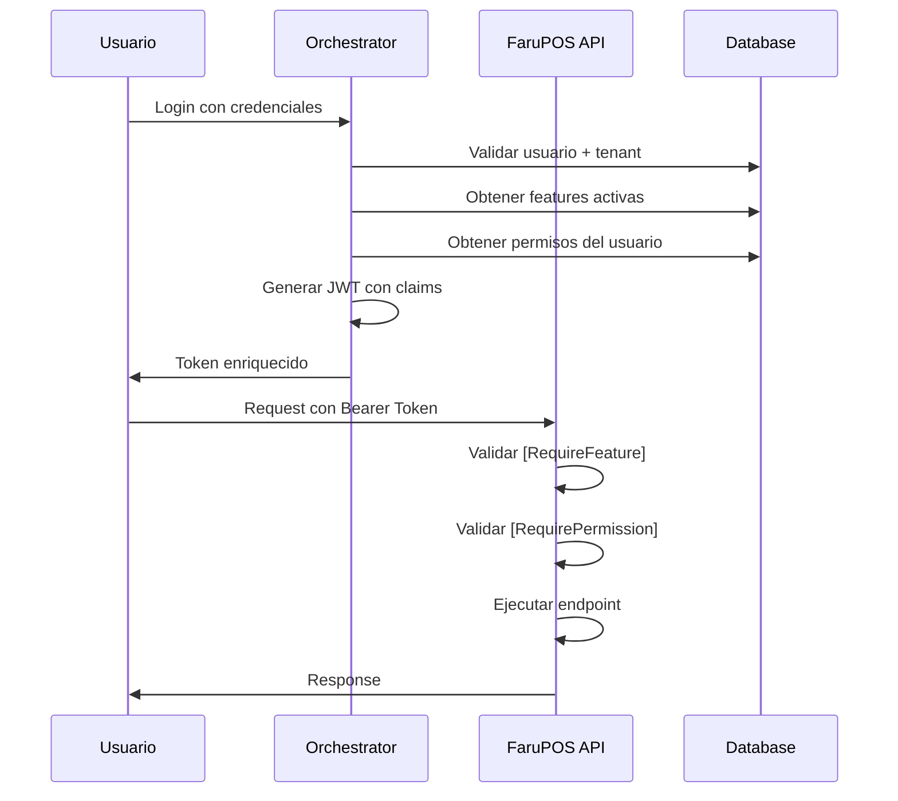

# 🚀 FaruPOS - Sistema de Seguridad Feature-Based

## 🎯 Visión General

**FaruPOS** (Farutech Point of Sale) implementa un sistema de seguridad de alto rendimiento basado en **claims JWT** que combina:

1. **Features** (funcionalidades del plan de suscripción)
2. **Permissions** (permisos a nivel de usuario/rol)
3. **Validación en token** (sin consultas a BD en cada request)

### Principio Fundamental

```
Permisos Efectivos = Permisos del Sistema ∩ Features Activas ∩ Permisos del Usuario
```

Un usuario **solo puede ejecutar acciones** si:
- ✅ El tenant tiene la feature activa en su suscripción
- ✅ El usuario tiene el permiso asignado en su rol
- ✅ Ambos claims están presentes en el JWT

---

## 🏗️ Arquitectura

### 1. Token JWT Enriquecido

El token generado por `FaruPOSTokenGenerator` incluye:

```json
{
  "sub": "user-guid",
  "email": "user@example.com",
  "tenant_id": "tenant-guid",
  "tenant_name": "Empresa XYZ",
  "role": "Manager",
  
  // 🔥 CLAIMS DE SEGURIDAD
  "features": "POS_BASIC,INV_BASIC,RPT_STANDARD",
  "permissions": "POS.READ,POS.WRITE,INV.READ,RPT.VIEW",
  
  "app": "FaruPOS",
  "version": "1.0.0"
}
```

### 2. Flujo de Autenticación



### 3. Attributes de Validación

#### `[RequireFeature]` - Validación de Feature

```csharp
[HttpGet("products")]
[RequireFeature("POS_BASIC")]  // 🔒 Requiere feature POS_BASIC activa
public async Task<IActionResult> GetProducts()
{
    // Solo se ejecuta si el tenant tiene POS_BASIC en su suscripción
}
```

#### `[RequirePermission]` - Validación de Permiso

```csharp
[HttpPost("sales")]
[RequirePermission("POS.WRITE")]  // 🔒 Requiere permiso POS.WRITE
public async Task<IActionResult> CreateSale([FromBody] CreateSaleRequest request)
{
    // Solo se ejecuta si el usuario tiene permiso POS.WRITE
}
```

#### Combinación de Ambos

```csharp
[HttpDelete("products/{id}")]
[RequireFeature("INV_ADVANCED")]      // Tenant debe tener feature avanzada
[RequirePermission("INV.DELETE")]     // Usuario debe tener permiso de eliminación
public async Task<IActionResult> DeleteProduct(Guid id)
{
    // Doble validación: feature Y permiso
}
```

---

## 📋 Catálogo de Features y Permisos

### Features Disponibles

| Código | Nombre | Descripción |
|--------|--------|-------------|
| `POS_BASIC` | POS Básico | Ventas y cobros básicos |
| `POS_ADVANCED` | POS Avanzado | Cotizaciones, apartados, facturación |
| `INV_BASIC` | Inventario Básico | Consulta de stock |
| `INV_ADVANCED` | Inventario Avanzado | Ajustes, transferencias, lotes |
| `RPT_STANDARD` | Reportes Estándar | Reportes predefinidos |
| `RPT_CUSTOM` | Reportes Custom | Reportes personalizados |
| `CUS_BASIC` | Clientes Básico | CRUD de clientes |
| `CUS_LOYALTY` | Programa de Lealtad | Puntos y recompensas |

### Permisos por Módulo

#### **POS - Point of Sale**
- `POS.READ` - Ver ventas
- `POS.WRITE` - Crear ventas
- `POS.REFUND` - Procesar devoluciones
- `POS.DISCOUNT` - Aplicar descuentos
- `POS.CLOSE_DAY` - Cerrar caja

#### **INV - Inventory**
- `INV.READ` - Ver inventario
- `INV.WRITE` - Crear/editar productos
- `INV.DELETE` - Eliminar productos
- `INV.ADJUST` - Ajustar stock
- `INV.TRANSFER` - Transferir entre bodegas

#### **RPT - Reports**
- `RPT.VIEW` - Ver reportes
- `RPT.EXPORT` - Exportar reportes
- `RPT.CREATE` - Crear reportes custom
- `RPT.SCHEDULE` - Programar reportes

#### **CUS - Customers**
- `CUS.READ` - Ver clientes
- `CUS.WRITE` - Crear/editar clientes
- `CUS.DELETE` - Eliminar clientes
- `CUS.LOYALTY_VIEW` - Ver puntos de lealtad
- `CUS.LOYALTY_REDEEM` - Redimir puntos

---

## 🛡️ Implementación en Endpoints

### Ejemplo Completo de Controller

```csharp
using Farutech.App01.POS.API.Attributes;
using Microsoft.AspNetCore.Authorization;
using Microsoft.AspNetCore.Mvc;

namespace Farutech.App01.POS.API.Controllers;

[ApiController]
[Route("api/[controller]")]
[Authorize]  // Requiere autenticación JWT
public class SalesController : ControllerBase
{
    [HttpGet]
    [RequireFeature("POS_BASIC")]
    [RequirePermission("POS.READ")]
    public async Task<IActionResult> GetSales()
    {
        // Ver historial de ventas
        return Ok();
    }

    [HttpPost]
    [RequireFeature("POS_BASIC")]
    [RequirePermission("POS.WRITE")]
    public async Task<IActionResult> CreateSale([FromBody] CreateSaleRequest request)
    {
        // Crear nueva venta
        return Ok();
    }

    [HttpPost("{id}/refund")]
    [RequireFeature("POS_ADVANCED")]  // Devoluciones requieren plan avanzado
    [RequirePermission("POS.REFUND")]
    public async Task<IActionResult> RefundSale(Guid id)
    {
        // Procesar devolución
        return Ok();
    }

    [HttpPost("{id}/discount")]
    [RequireFeature("POS_BASIC")]
    [RequirePermission("POS.DISCOUNT")]
    public async Task<IActionResult> ApplyDiscount(Guid id, [FromBody] DiscountRequest request)
    {
        // Aplicar descuento
        return Ok();
    }

    [HttpPost("close-day")]
    [RequireFeature("POS_BASIC")]
    [RequirePermission("POS.CLOSE_DAY")]
    public async Task<IActionResult> CloseDay()
    {
        // Cerrar caja del día
        return Ok();
    }
}
```

---

## 🔧 Configuración

### 1. Program.cs

```csharp
// Registrar servicios de seguridad
builder.Services.AddScoped<IPermissionService, SmartPermissionService>();
builder.Services.AddScoped<FaruPOSTokenGenerator>();

// Configurar JWT Authentication
builder.Services.AddAuthentication(JwtBearerDefaults.AuthenticationScheme)
    .AddJwtBearer(options =>
    {
        options.TokenValidationParameters = new TokenValidationParameters
        {
            ValidateIssuer = true,
            ValidateAudience = true,
            ValidateLifetime = true,
            ValidateIssuerSigningKey = true,
            ValidIssuer = builder.Configuration["Jwt:Issuer"],
            ValidAudience = builder.Configuration["Jwt:Audience"],
            IssuerSigningKey = new SymmetricSecurityKey(
                Encoding.UTF8.GetBytes(builder.Configuration["Jwt:SecretKey"]))
        };
    });

builder.Services.AddAuthorization();
```

### 2. appsettings.json

```json
{
  "Jwt": {
    "SecretKey": "your-super-secret-key-min-32-characters",
    "Issuer": "Farutech.Orchestrator",
    "Audience": "Farutech.FaruPOS"
  }
}
```

---

## ⚡ Performance

### Ventajas del Sistema de Claims

1. **Zero Database Lookups** ❌🗄️
   - No se consulta la BD en cada request
   - Validación instantánea desde el token

2. **Sub-milisecond Validation** ⚡
   - Parsing de claims: ~0.01ms
   - String.Contains(): ~0.001ms

3. **Horizontal Scaling** 📈
   - Sin estado compartido
   - Cada instancia valida independientemente

4. **Cache-Friendly** 💾
   - Token cacheado en el cliente
   - No invalidación de cache en backend

### Comparación

| Método | Latencia | DB Queries | Escalabilidad |
|--------|----------|------------|---------------|
| **Claims JWT** | <1ms | 0 | ⭐⭐⭐⭐⭐ |
| Policy-based | 5-10ms | 1-2 | ⭐⭐⭐ |
| DB Lookup | 50-100ms | 3-5 | ⭐⭐ |

---

## 🔄 Actualización de Permisos

### Cuándo se actualizan los claims

Los claims se actualizan cuando:

1. **Login** - Se genera token inicial
2. **Select Context** - Se cambia de organización
3. **Refresh Token** - Token expira y se renueva (cada 8 horas)
4. **Feature Upgrade** - Admin actualiza suscripción (requiere re-login)

### Forzar Actualización

Si se modifica la suscripción o permisos del usuario:

```csharp
// Opción 1: Usuario debe cerrar sesión y volver a entrar
// Opción 2: Implementar refresh token automático

[HttpPost("refresh-permissions")]
public async Task<IActionResult> RefreshPermissions()
{
    var userId = User.FindFirst(ClaimTypes.NameIdentifier)?.Value;
    var tenantId = User.FindFirst("tenant_id")?.Value;
    
    // Regenerar token con permisos actualizados
    var newToken = await _tokenGenerator.GenerateEnrichedToken(...);
    
    return Ok(new { accessToken = newToken });
}
```

---

## 🧪 Testing

### Test Unitario de Attributes

```csharp
[Fact]
public void RequireFeature_ShouldBlock_WhenFeatureNotInClaims()
{
    // Arrange
    var attribute = new RequireFeatureAttribute("POS_ADVANCED");
    var context = CreateAuthorizationContext(features: "POS_BASIC");
    
    // Act
    attribute.OnAuthorization(context);
    
    // Assert
    Assert.IsType<ObjectResult>(context.Result);
    Assert.Equal(403, ((ObjectResult)context.Result).StatusCode);
}
```

### Test de Integración

```csharp
[Fact]
public async Task CreateSale_ShouldReturn403_WithoutFeature()
{
    // Arrange
    var token = GenerateTokenWithoutFeature("POS_BASIC");
    _client.DefaultRequestHeaders.Authorization = 
        new AuthenticationHeaderValue("Bearer", token);
    
    // Act
    var response = await _client.PostAsync("/api/sales", content);
    
    // Assert
    Assert.Equal(HttpStatusCode.Forbidden, response.StatusCode);
}
```

---

## 📊 Monitoreo

### Logs Recomendados

```csharp
_logger.LogWarning(
    "Access denied to {Endpoint} for user {UserId} - Missing feature: {Feature}",
    context.HttpContext.Request.Path,
    userId,
    _featureCode);

_logger.LogWarning(
    "Access denied to {Endpoint} for user {UserId} - Missing permission: {Permission}",
    context.HttpContext.Request.Path,
    userId,
    _permissionCode);
```

### Métricas a Monitorear

- Total de 403 por feature faltante
- Total de 403 por permiso faltante
- Features más demandadas
- Permisos más usados

---

## 🚀 Roadmap

### Próximas Mejoras

- [ ] **Rate Limiting** por feature (POS_BASIC: 1000 req/h, POS_ADVANCED: ilimitado)
- [ ] **Feature Flags** dinámicos (activar/desactivar sin re-deploy)
- [ ] **Auditoría** de intentos de acceso denegados
- [ ] **Analytics** de uso de features por tenant
- [ ] **Auto-upgrade prompts** cuando se requiere feature no disponible

---

## 📚 Referencias

- [JWT Best Practices](https://datatracker.ietf.org/doc/html/rfc8725)
- [OWASP Authorization Cheat Sheet](https://cheatsheetseries.owasp.org/cheatsheets/Authorization_Cheat_Sheet.html)
- [Feature-Based Access Control](https://en.wikipedia.org/wiki/Attribute-based_access_control)

---

**FaruPOS** - Powered by Farutech © 2025
